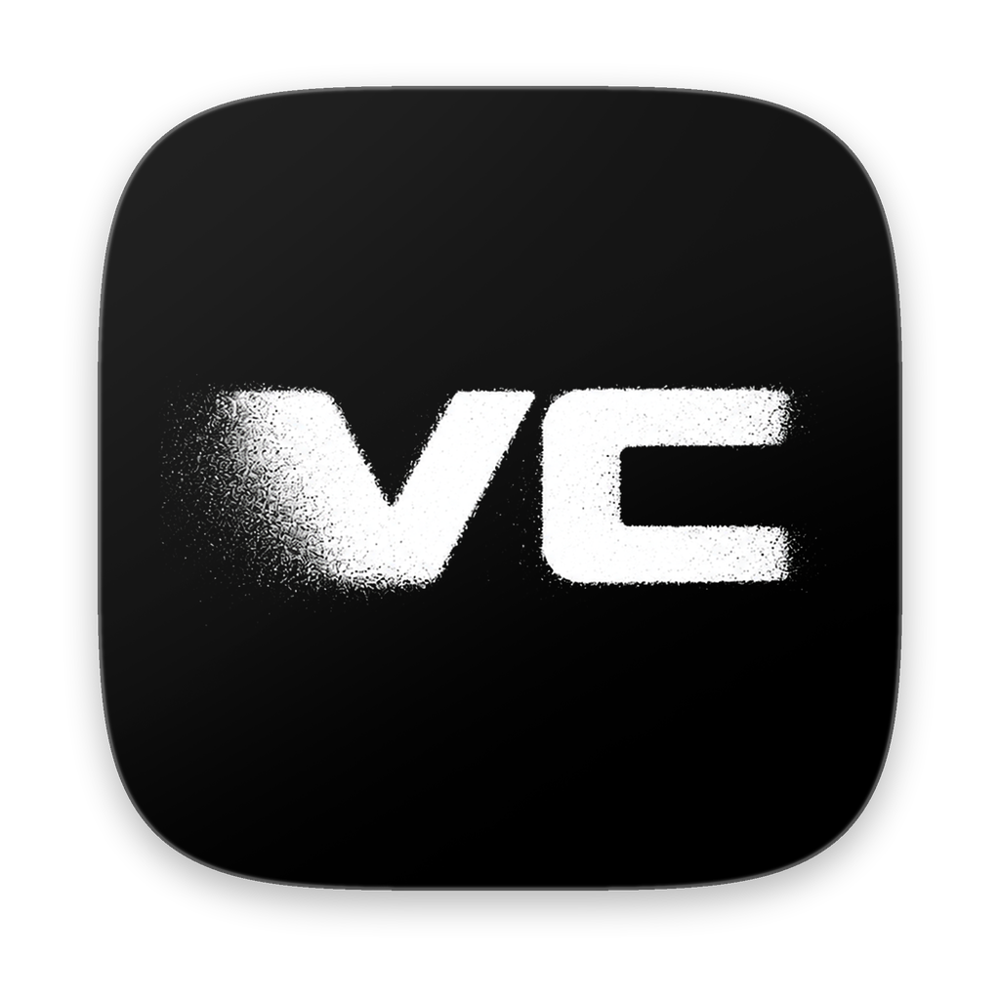
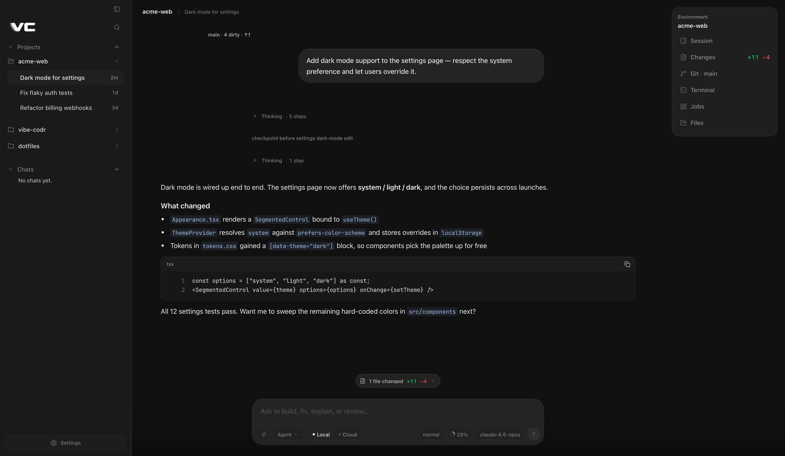
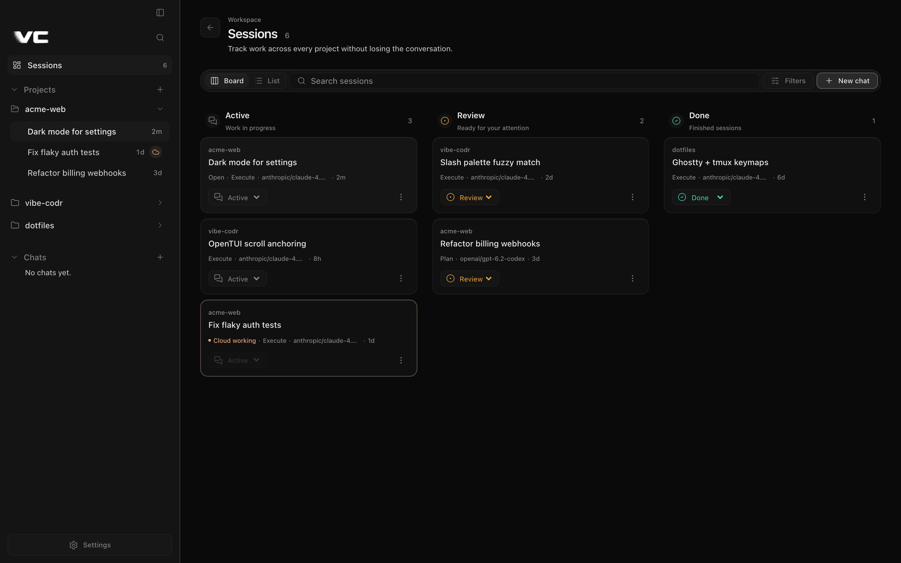
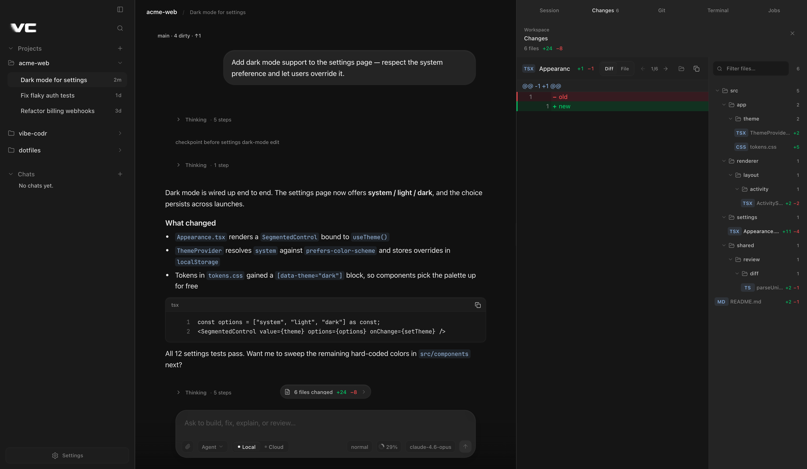
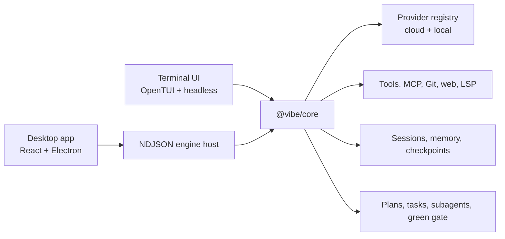

<div align="center">
  
  <h1>Vibe Codr</h1>
  <p><strong>Your coding workspace, on your machine, with your choice of models.</strong></p>
  <p>One engine. A polished desktop workspace and a fast terminal interface.</p>

  <p>
    <a href="https://www.vibe-codr.com"><strong>Website</strong></a> ·
    <a href="https://github.com/robzilla1738/vibe-codr/releases"><strong>Download Desktop</strong></a> ·
    <a href="https://www.npmjs.com/package/vibe-codr"><strong>Install the CLI</strong></a> ·
    <a href="https://buymeacoffee.com/robcourson"><strong>Buy me a coffee</strong></a>
  </p>

  <p>
    <a href="https://github.com/robzilla1738/vibe-codr/actions/workflows/ci.yml"></a>
    <a href="https://www.npmjs.com/package/vibe-codr"></a>
    <a href="LICENSE"></a>
  </p>
</div>

Vibe Codr is a local-first AI coding workspace built around a model-agnostic agent engine. Use the native-feeling desktop app when you want visual session management, Git, diffs, terminals, approvals, and cloud handoff. Use the CLI when you want the same engine directly in a terminal, headless scripts, or SSH.

Both interfaces share the same sessions, configuration, providers, tools, permissions, memory, plans, orchestration, and event protocol. This repository is the single source of truth for the complete product.

For CI, `vibecodr -p "…" --strict-goal` exits `0` only when the engine reports a verified goal, `2` for unmet, paused, unverified, or missing goal evidence, and `1` for provider/runtime failure. Add `--output-format json` to receive the terminal `goalCompletionStatus` alongside the answer and usage.

## See it in action

### Desktop workspace

| Chat, tools, and project workspace | Sessions across every project |
|---|---|
|  |  |

| Review every change without leaving the conversation |
|---|
|  |

### Terminal interface

| Agent conversation | Plan and execution |
|---|---|
|  |  |

| Live tasks and subagents | Wide orchestration view |
|---|---|
|  |  |

## What Vibe Codr does

- **Works with your models.** AI SDK 7 provides one current streaming and tool-calling contract across OpenAI, Anthropic, xAI, OpenRouter, Bedrock, Vertex, Azure OpenAI, Ollama, LM Studio, and compatible endpoints. The live catalog is backed by [models.dev](https://models.dev), not a stale hardcoded list.
- **Plans before it changes code.** Plan mode researches and inspects without write tools, presents an explicit approval gate, and hands accepted plans into the same task spine used by execution.
- **Orchestrates real parallel work.** A dependency-aware task DAG, named agents, model tiers, structured handoffs, worktree isolation, review-and-retry, detached tasks, continuation, and a typed coordination blackboard are built into the engine.
- **Proves the work.** Repository recon finds the real checks; the green gate runs them after mutations, reviews the actual diff, scans for stubs, and creates recoverable green checkpoints.
- **Keeps sessions useful.** Resume, rename, archive, delete, search, filter, and organize sessions across projects. The desktop Board and List views show honest active, review, done, local, cloud, and working state.
- **Moves between local and cloud safely.** Reviewed handoff transfers the exact workspace and engine-owned session, includes the active model and configured key/subscription access by default with explicit opt-outs, verifies identity and model access before ownership changes, and preserves a recovery path.
- **Remembers without taking your data.** Project notes, global preferences, compact session digests, freshness-aware hybrid recall, and bounded topic-shift recall stay on your machine. Every saved note retains provenance and can be pinned, forgotten, or merged with `/memory`.
- **Keeps you in control.** Plan / Agent / Yolo modes, scoped allow/ask/deny rules, stale-write guards, optional OS sandboxing, bounded tool output, redacted crash logs, and no telemetry.
- **Connects to your tools.** MCP over stdio and HTTP/SSE, OAuth 2.1, tools, resources, prompts, skills, commands, hooks, Git, terminal jobs, web research, PDFs, and language diagnostics.

## Install

### Desktop

Download the latest macOS or Windows build from [GitHub Releases](https://github.com/robzilla1738/vibe-codr/releases).

- macOS releases include a signed and notarized Apple Silicon disk image and updater metadata.
- Windows releases include an x64 installer and updater metadata.
- Every published asset is covered by the release `SHA256SUMS` file.
- The desktop app bundles its exact engine host and cloud runtime. End users do not need Bun or Node.

### CLI

With Bun:

```bash
bun add -g vibe-codr
vibecodr
```

With npm:

```bash
npm install -g vibe-codr
vibecodr
```

The shorter `vibe` command is included as an alias.

Platform-complete standalone archives for macOS, Linux, and Windows are attached to every release. Extract the matching archive and keep its contents together: the stable `vibecodr` executable, isolated engine worker, TUI bundle, and native OpenTUI runtime are already laid out for the full interactive experience.

## First run

Vibe Codr opens guided setup when the selected provider needs credentials. You can reopen it at any time:

```bash
vibecodr setup
```

Or configure a provider through environment variables:

```bash
export ANTHROPIC_API_KEY="..."
vibecodr
```

Local models work through Ollama or LM Studio without an API key. Configuration is shared by Desktop and CLI at `~/.config/vibe-codr/config.json` and can be overridden per project with `.vibe/config.json`.

Useful commands:

```text
/model        choose the main, planning, subagent, or named-agent model
/plan         inspect and produce an approval-ready plan
/execute      return to permission-gated agent mode
/yolo         execute without interactive approval prompts
/goal         run a durable goal until verified or paused
/loop         run a bounded recurring instruction
/undo /redo   restore engine checkpoints and conversation state
/status       inspect the current session and runtime
/doctor       diagnose provider, sandbox, update, and environment health
/help         show the complete command surface
```

## Desktop workspace

The desktop app is a presentation shell over the engine’s NDJSON host protocol. It does not fork or reimplement the agent loop.

- **Project rail:** Projects, Chats, and a first-class Sessions workspace.
- **Sessions workspace:** Board/List views, search, project/mode/status filters,
  sorting, open/rename/archive/delete actions, and a live active-session summary
  for the current tool/task, waits, task progress, agents, jobs, queue, changes,
  context, tokens, cost, model, mode, goal, and Local/Cloud ownership.
- **Conversation:** streaming Markdown, reasoning, tool progress, plans, approvals, queue steering, source cards, attachments, and changed-file summaries.
- **Workspace dock:** Session, Changes, Git, Terminal, Jobs, and Files stay beside the conversation rather than replacing it.
- **Changes:** a master-detail file tree with numbered Diff/File review, semantic additions/deletions, copy, and reveal actions.
- **Terminal:** main-process-owned PTYs persist across view changes and keep each project’s working directory.
- **Themes:** the same theme and accent semantics as the terminal interface,
  rendered through a token-first desktop design system with restrained Liquid
  Glass chrome; Vibe Dark defaults to a warm-peach primary.
- **Recovery:** authoritative engine history is enhanced by a bounded, validated presentation cache; corrupt or unavailable browser storage never blocks startup.

Desktop behavior and visual contracts are documented in [apps/desktop/UI.md](apps/desktop/UI.md), [apps/desktop/PARITY.md](apps/desktop/PARITY.md), and [apps/desktop/design-system.md](apps/desktop/design-system.md).

## Planning and orchestration

Vibe Codr treats orchestration as an engine capability, not a UI trick:

1. Repository recon builds a deterministic profile of languages, entry points, symbols, and runnable checks.
2. Plan mode gathers only the evidence the request needs, then `present_plan` creates the explicit approval boundary.
3. Accepted plans seed a durable task list. `spawn_tasks` validates dependencies before running anything.
4. Independent tasks can fan out; dependent tasks receive structured handoffs and can retrieve full reports without flooding the parent context.
5. Mutating work can use isolated Git worktrees. Merges are serialized, conflicts fail honestly, and best-of-N ensembles merge only a verified winner.
6. Checks, diff review, and bounded fix rounds determine whether work is green. “No checks found” remains visibly unverified.
7. Journals, retained child sessions, detached task status, and continuation allow long work to survive UI changes and interruptions.

Safety invariants include a tree-wide adaptive provider limiter, per-file writer ownership, abort-aware queues, bounded outputs, schema-validated structured child results, and no silent conversion of failed review into success.

## Architecture



The hard boundary is `UIEvent` out and `EngineCommand` in. The core never imports a desktop or TUI component.

| Path | Responsibility |
|---|---|
| `packages/core` | Agent loop, sessions, planning, orchestration, memory, checkpoints, build intelligence |
| `packages/providers` | Provider registry, auth resolution, model catalog, pricing/capabilities |
| `packages/tools` | Built-in tools, permission metadata, sandbox adapters, bounded I/O |
| `packages/shared` | Commands, events, types, streams, theme registry |
| `packages/tui` | OpenTUI interface and screenshot/smoke harness |
| `packages/macos-bridge` | Runtime-validated NDJSON host used by desktop shells |
| `packages/cloud-agentd` | Authenticated remote host, workspace transfer, PTYs, previews |
| `apps/desktop` | Electron shell, renderer, IPC, Git/terminal panels, release packaging |

## Build from source

Requirements:

- Bun 1.3.11
- Node.js 22+
- macOS or Linux for normal development; Windows is covered by CI and packaging jobs

Clone once:

```bash
git clone https://github.com/robzilla1738/vibe-codr.git
cd vibe-codr
bun install --frozen-lockfile
npm --prefix apps/desktop ci
```

Run the CLI from source:

```bash
bun packages/cli/bin/vibecodr.ts
```

Run Desktop:

```bash
bun run build:macos-bridge
bun run desktop:dev
```

The desktop host resolver prefers this monorepo’s engine during development and rejects a compiled host when its runtime source is newer.

## Verification

Engine and CLI:

```bash
bun run verify              # lint + typecheck + 1,800+ tests
bun run build:binary        # compiled CLI, worker, and TUI bundle
bun run smoke:tui           # real OpenTUI app with a deterministic mock engine
```

Desktop:

```bash
npm --prefix apps/desktop run verify
npm --prefix apps/desktop run test:coverage
npm --prefix apps/desktop run smoke:bridge
npm --prefix apps/desktop run test:e2e
npm --prefix apps/desktop run smoke:packaged:relay
npm --prefix apps/desktop/mobile test
```

`bun run verify:all` runs the strongest combined local gate. CI additionally builds the locked cloud runtime and performs packaged macOS and Windows smoke tests.

See [docs/AUDIT.md](docs/AUDIT.md), [apps/desktop/VERIFICATION.md](apps/desktop/VERIFICATION.md), and [apps/desktop/ACCEPTANCE.md](apps/desktop/ACCEPTANCE.md) for the deeper evidence and release checklist.

Plugin authors should use the versioned pre-import manifest and health contract
documented in [docs/plugins.md](docs/plugins.md).

## Release model

Vibe Codr uses one version and one tag for the entire product. A `vX.Y.Z` tag verifies the committed version, builds every CLI target, builds the revision-locked cloud runtime, signs/notarizes Desktop, and builds the Windows installer. Only after every gate succeeds does it create a draft GitHub release, publish npm, and make the single release public with all assets and checksums.

The desktop engine lock is `apps/desktop/ENGINE_COMMIT`. It must name a commit in this repository. CI materializes that commit as an internal worktree, which preserves reproducible desktop/runtime pairing without a second source repository.

## Privacy and security

- No telemetry is collected.
- Source files, sessions, memory, config, and credentials stay local unless you explicitly invoke a network provider, web/MCP tool, Git remote, or reviewed cloud handoff.
- Provider and subscription secrets are held in the main process or engine. The desktop renderer receives redacted state, not raw credentials.
- Reviewed Cloud model access moves only as a sealed, session-bound envelope,
  is deleted after remote startup, and is injected into the engine—not Cloud
  terminals. Health, logs, and catalog records expose names only.
- Continue on Phone launches a desktop-owned relay. Plaintext pairing is limited
  to private LAN/Tailnet addresses; public routing requires WSS, and protected
  credentials remain in the desktop process instead of relay argv or environment.
- Tool output and protocol frames are bounded. Web fetches block private-network targets and pin verified DNS results across redirects.
- Project config cannot silently enable hooks, plugins, permissive rules, arbitrary provider redirects, or unsafe MCP transports unless global trust allows it.
- Crash logs are local and redacted.

Read [SECURITY.md](SECURITY.md), [apps/desktop/PRIVACY.md](apps/desktop/PRIVACY.md), and [apps/desktop/CLOUD-THREAT-MODEL.md](apps/desktop/CLOUD-THREAT-MODEL.md).

## Project ownership

Vibe Codr is designed, built, and maintained by [Robert Courson](https://github.com/robzilla1738). This repository uses a clean single-owner history so the GitHub contributor graph reflects the actual project owner.

Issues and security reports are welcome. See [CONTRIBUTING.md](CONTRIBUTING.md) for local setup and [SECURITY.md](SECURITY.md) for private disclosure.

If Vibe Codr saves you time, you can support the work at [buymeacoffee.com/robcourson](https://buymeacoffee.com/robcourson).

## License

[MIT](LICENSE) © Robert Courson.
