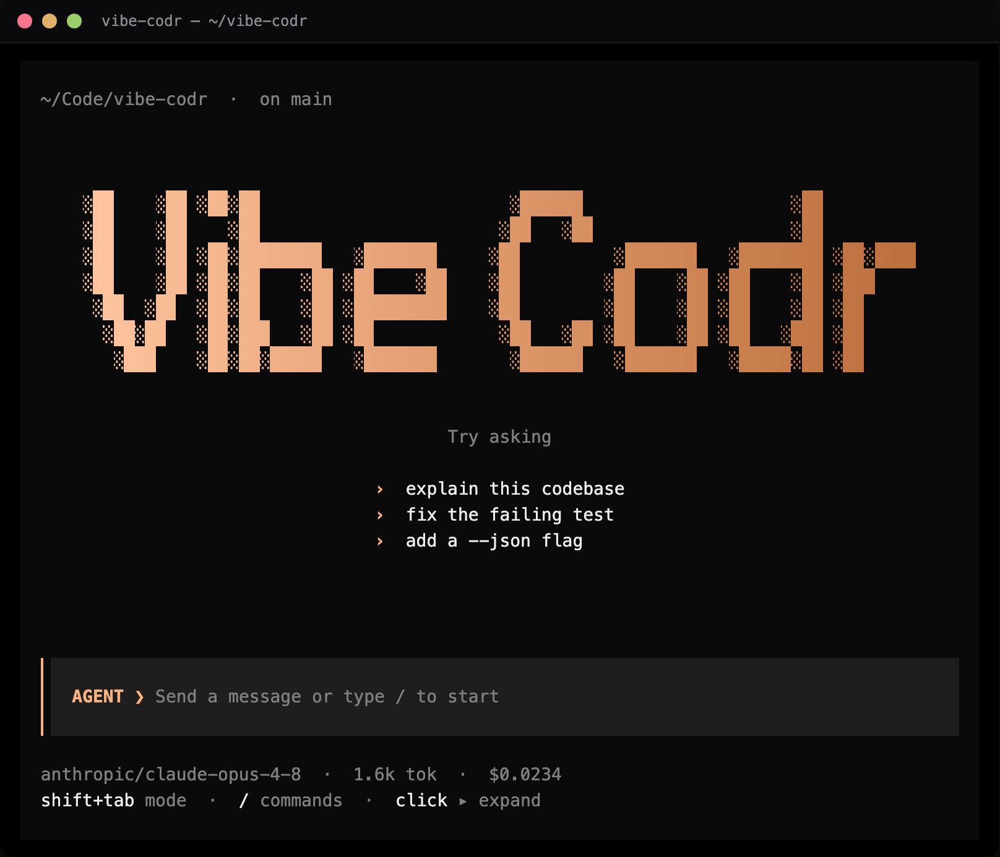
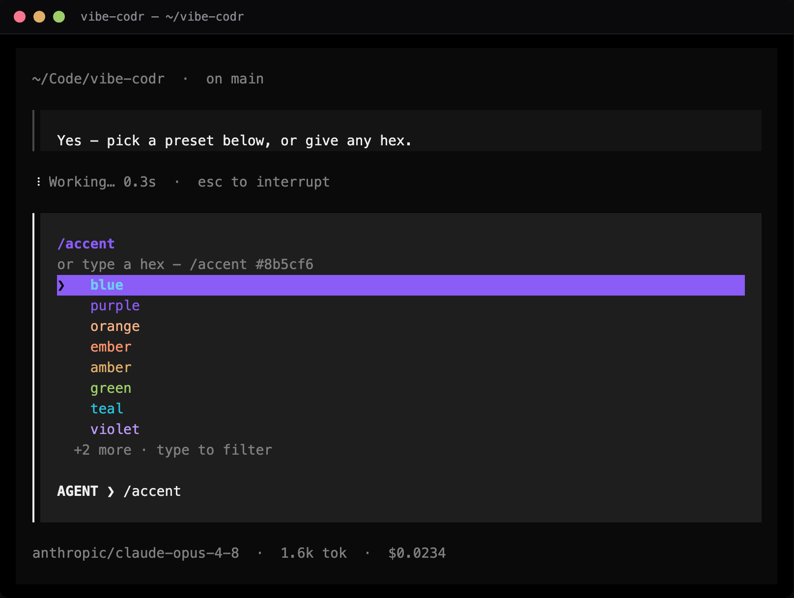
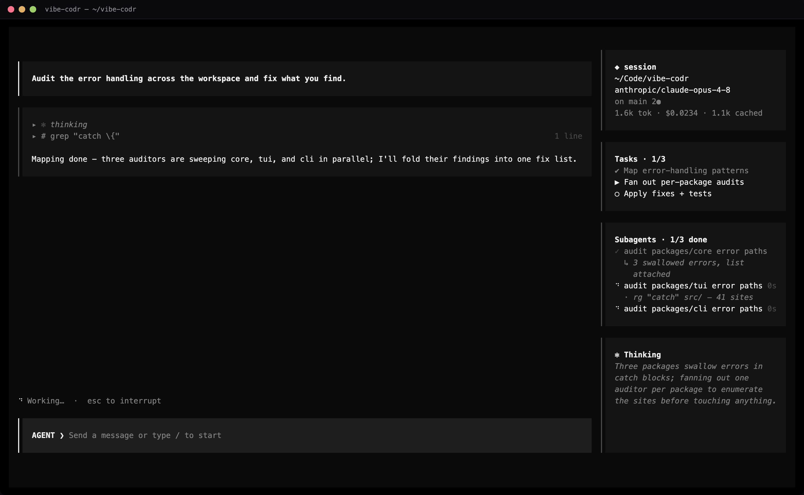
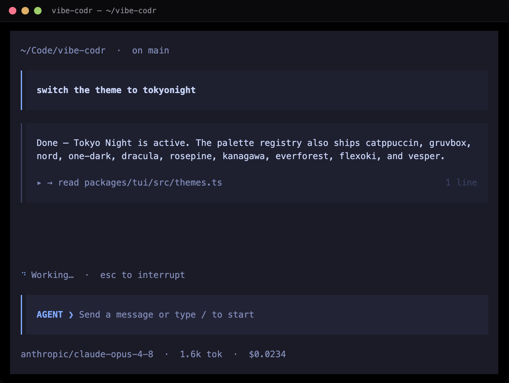

# vibe-codr

[](https://github.com/robzilla1738/vibe-codr/actions/workflows/ci.yml)
[](https://www.npmjs.com/package/vibe-codr)
[](LICENSE)
[](https://buymeacoffee.com/robcourson)

A **model-agnostic** CLI coding agent for the terminal — in the
class of Claude Code / Codex / opencode, but able to drive coding and agentic
tasks on *any* model: local models via **Ollama** and **LM Studio**, aggregators
(**OpenRouter, Fireworks, Together, Baseten, Hugging Face**), and first-party
providers (**OpenAI, Anthropic, Google Gemini, Meta Muse Spark, Z.ai/GLM, Moonshot/Kimi,
Alibaba/Qwen, DeepSeek, xAI/Grok, Groq, Mistral, Cerebras, Perplexity,
MiniMax**) — plus **OpenAI Codex via your `codex login` session** and a
generic **custom** provider for any OpenAI-compatible endpoint (your own base URL +
key). Model context windows, pricing, and capabilities come live from
[models.dev](https://models.dev) (24h cache; `/models refresh` to force the
latest), with a small published fallback for brand-new APIs not yet in the
catalog (e.g. Meta Muse Spark 1.1).

> Status: **feature-complete.** Multi-provider agent loop, live model catalog,
> **plan / execute / yolo** modes (Shift+Tab to cycle) with a permission layer, a
> live **task list**, an observable **prompt queue**, an interactive
> **slash-command menu**, skills / plugins, `/goal` + `/loop`, checkpoints/undo,
> self-verify, cache-aware cost tracking, and session persistence with
> context-aware compaction. On top of that:
>
> - **Long-term memory** — hybrid recall (BM25 + optional on-device semantic
>   embeddings, fused with reciprocal-rank fusion) over saved facts and past
>   sessions, a deduplicating `save_memory` write-path with a `user` scope that
>   grows the always-injected global `USER.md`, and default-on
>   proactive recall + cross-session digests (digests only for interactive
>   sessions — headless `-p` runs never pay an extra call). Fully offline; degrades to lexical
>   when no embedder is present.
> - **Engine-owned build intelligence** — deterministic **repo recon** (your
>   real build/typecheck/test/lint commands, injected into every agent — no
>   guessing), a parsed **`run_check`** (`PASS 142/142`, not log spew), an
>   automatic **green-gate** after mutating turns with bounded fix rounds,
>   **green checkpoints** (commit-on-green that never touches your branch),
>   an **adversarial diff review** + deterministic **stub scan**, optional
>   **browser verification** (screenshot + click every control, flag dead
>   ones), and **multi-language diagnostics in the loop** on every edit —
>   in-process TypeScript plus an **LSP client** that lazy-spawns whatever server
>   is on your `PATH` (pyright, gopls, rust-analyzer, clangd, jdtls, ruby-lsp, …),
>   deadline-bounded so a slow server never wedges an edit and advisory-only so a
>   crash degrades to nothing, never a false "clean".
> - **Multi-agent orchestration** — parallel subagents with **exclusive per-file
>   write ownership**, a typed coordination **blackboard**, a tree-global
>   **adaptive concurrency limiter**, and a default-ON deterministic **task-DAG
>   scheduler** (`spawn_tasks`) with **structured handoffs**, a `read_report`
>   tool, **model tiers** (cheap/strong), executable verify→retry against the
>   real checks, **git-worktree isolation** for parallel writers (opt-in
>   best-of-N ensembles), a journaled **resume**, and live per-child activity —
>   plus **subagent continuation** (`continue_subagent` resumes a finished child's
>   full context), **schema-validated structured output** (an `outputSchema` the
>   child's answer must satisfy, or it returns the errors — never a fabricated
>   object), and **detached background spawns** (`detach:true` + `check_task`).
> - **Research** — **keyless web search** that fans out across DuckDuckGo + Bing
>   and quality-ranks the deduped merge (TinyFish optional), with **deep-mode
>   passage enrichment** (fetches the top pages and quotes dated passages),
>   zero-result **query reformulation**, a bounded **`crawl_docs`** site
>   crawler, a per-session **source ledger** with `[n]` citations (`/sources`),
>   a ranked import-graph **`repo_map`**, and hardened `webfetch` (SSRF-guarded
>   with **DNS-rebinding-safe IP pinning**, per-redirect revalidation,
>   charset-aware markdown extraction, paywall-shell detection, **Wayback
>   recovery**, **PDF** extraction with a deflate-bomb guard, cache-through
>   with request coalescing).
> - **Safety** — a glob-based allow/deny/ask **permission layer** (deny is an
>   absolute kill-switch; rules match every equivalent path spelling) with,
>   underneath it, **opt-in OS sandboxing** — a macOS **Seatbelt** / Linux
>   **bubblewrap** backstop that confines writes to your workspace and can cut
>   network, with a fail-closed `dangerouslyUnsandboxed` escape hatch.
> - **MCP** — stdio + Streamable-HTTP/SSE transports, tools, **resources**,
>   **prompts**, **OAuth 2.1**, and auto-reconnect + `tools/list_changed`.
> - **Planning** — an interactive **plan-approval modal** (accept & execute,
>   revise, or keep planning) that seeds the task list from the plan.
> - **Extensibility** — declarative shell/HTTP **hooks**, project + global
>   skills/commands, and per-agent tool allowlists.
> - **Ships as a product** — prebuilt **standalone binaries** (darwin/linux ×
>   arm64/x64, checksummed) and an **npm/bun package**, a tag-driven release
>   pipeline, `vibe upgrade` + a quiet opt-out update check, and **crash
>   visibility** (redacted crash log + terminal restore, no telemetry).
>
> A full slash-command surface (`/status` `/cost` `/config` `/diff` `/recall`
> `/mcp` `/review` `/doctor` `/export` …) makes every setting and bit of session
> state reachable. All covered by **900+ tests** (including mock-model integration
> tests of the agent loop with zero network) plus a TUI render smoke test and a
> compiled-binary check.
>
> The terminal command is **`vibecodr`** (`vibe` works as an alias).

## Screenshots

An opencode-inspired terminal UI on vibe-codr's own engine, with a deliberate
color language: a **near-black graphite background** with **filled panel cards**
and a **thin left rail** on every block (no box-drawing borders — they gap into
dashes on terminals with line spacing). The chrome is **white-first** (opencode's
neutral scale): the **VIBE CODR wordmark**, panel titles, the **user-message
rail**, the active task/step, and the input caret all read in the body white,
while a **royal violet (`#8b5cf6`)** is saved for the few emphasis moments —
the selected menu row's solid band (dark text on it), menu section headers, and
markdown headings. The input's **mode
label, rail + caret** (`AGENT ❯` in the accent · `PLAN ❯` green · `YOLO ❯` red)
make switching mode unmistakable without repainting the screen. Swap the accent
in one word — **`/accent blue`**, or `purple`, `orange`, `ember`, `amber`,
`green`, `teal`, `violet`, `rose`, `white`, or any `/accent <hex>` — the swatch
submenu previews each hue live, and the wordmark fade, markers, and input rail
all follow it (`/theme opencode` keeps the classic peach look). The other colors are purely
functional — green/red on diffs with subtle background tints, amber on warnings, and one **calm muted tone**
for the tool-step / subagent rails. The layout is a **single, centered chat
column** (ChatGPT-style): it fills a narrow terminal and centers on a wide one,
with **no sidebar and no top header**. A fresh screen shows a **centered VIBE
CODR wordmark**; once you start, the column is the scrolling **transcript**, the
live status — the plan's **task list** and live **subagents** (one tidy line
each, tap to expand) — in panels above the input, and the input itself: a
**raised filled block with the mode-hued rail**. **All the details sit under the
input** — cwd · git, then model · changed-files · context · cost, plus key hints
and the goal. Each user turn sits in a filled card on the accent rail (**tap your
message to fold the whole exchange** under it), with the calm step rails and the
input aligned on one left edge; **assistant replies render as real Markdown** — prose
as Markdown, with **headings in the signature violet, blockquotes with a rail bar, and code
blocks + tables as clean native primitives** (aligned columns, accent header
row); tool calls read as a distinct icon + action (`$` bash, `→` read, `←` edit,
`✱` glob/grep, `◈` websearch, `±` git…) and **condense to one line you click to
expand**, while edits fold into a single diff row with the hunk shown beneath it
and **search steps expand to clean source cards**; a **rainbow braille spinner**
(hue-cycling — the "model is thinking" signature) shows live work; the **slash
menu docks flush to the input as one connected control**
and drills into rich submenus (a searchable model picker, clickable toggles).

| Chat + tool calls | Live diff |
|---|---|
|  |  |

| Plan mode | Task list + subagents panels |
|---|---|
|  |  |

| Permission card | Slash-command menu |
|---|---|
|  |  |

| `/accent orange` — one word recolors the chrome | The `/accent` swatch submenu |
|---|---|
|  |  |

| Wide terminal — a session card (the block wordmark over dir · model · git · usage), Tasks, Subagents, and reasoning-only Thinking move to a right sidebar (tool work stays in the chat) |
|---|
|  |

| Ported classic themes (`/theme tokyonight`, catppuccin, gruvbox, …) |
|---|
|  |

<sub>Regenerate with `bun packages/tui/scripts/screenshot.ts docs/screenshots`
(renders the real OpenTUI app and rasterizes its actual cell grid — bundled
Playwright Chromium; pixel-for-pixel what the live UI paints).</sub>

## Stack

- **Runtime:** TypeScript + [Bun](https://bun.sh) (workspaces + Turbo).
- **Models:** [Vercel AI SDK v5](https://ai-sdk.dev) (`streamText` + `tool()` +
  `stopWhen: stepCountIs`) as a unified, always-current provider abstraction.
- **Catalog:** live provider `/v1/models` merged with the
  [models.dev](https://models.dev) capability/pricing catalog — never hardcoded.
- **TUI:** [OpenTUI](https://github.com/anomalyco/opentui) (Solid) for the
  interactive UI, with a guaranteed readline + headless fallback.

## Architecture

A hard **core/TUI boundary**: the engine emits a typed `UIEvent` stream and
accepts `EngineCommand`s; no UI type leaks into core, so the UI is swappable and
the engine is fully testable headless.

| Package | Owns |
|---|---|
| `@vibe/shared` | Contracts: `UIEvent`, `Message`/`Part`, `ToolDefinition`, `EngineClient`, errors, logger |
| `@vibe/config` | Zod config schema, file discovery + deep-merge, auth resolution |
| `@vibe/providers` | `ProviderRegistry`, `resolveModel`, `CatalogService` (models.dev + `/v1/models`) |
| `@vibe/tools` | Built-in tools with `readOnly` flags + the AI-SDK `tool()` adapter / `Toolset` |
| `@vibe/core` | Agent loop (`Session.run`), mode gating, subagent fork, event bus, `Engine` |
| `@vibe/plugins` | `HookBus`, `PluginApi`, slash-command + skill runtimes; config hooks accept stdout logs only before a final-line JSON directive |
| `@vibe/tui` | OpenTUI app + headless/REPL renderers |
| `@vibe/macos-bridge` | Runtime-validated NDJSON stdio host for the SwiftUI and Electron desktop shells (`bun run macos-bridge` / `build:macos-bridge`) |
| `@vibe/cli` | `bin/vibe` entrypoint (argv, config, headless `-p` vs TUI) |

## Install

Two channels — pick one:

**Standalone binary** (no runtime to install). Grab the build for your platform
from the [latest release](https://github.com/robzilla1738/vibe-codr/releases/latest),
verify it against `SHA256SUMS`, then drop it on your `PATH`:

```bash
# macOS arm64 shown; swap in darwin-x64 / linux-x64 / linux-arm64
curl -sSL -o vibecodr https://github.com/robzilla1738/vibe-codr/releases/latest/download/vibecodr-darwin-arm64
curl -sSL -o SHA256SUMS https://github.com/robzilla1738/vibe-codr/releases/latest/download/SHA256SUMS
shasum -a 256 -c SHA256SUMS --ignore-missing   # verify before trusting the binary
chmod +x vibecodr && sudo mv vibecodr /usr/local/bin/
```

**npm / bun** (requires [Bun](https://bun.sh) ≥ 1.2 on your `PATH` — vibe-codr
runs on the Bun runtime):

```bash
bun add -g vibe-codr        # or: npm install -g vibe-codr
vibecodr                    # `vibe` is an alias
```

Provider SDKs, the rich TUI (OpenTUI), MCP, and on-device embeddings are declared
as **optional dependencies**, so the install pulls what it can and the CLI
degrades gracefully when one is missing.

**Windows** — native Windows support is **experimental and currently untested**
(no maintainer runs Windows yet; the CI Windows job is advisory, not a merge
gate). A native `vibecodr-windows-x64.exe` is published on the
[releases page](https://github.com/robzilla1738/vibe-codr/releases/latest), but
the **recommended path is WSL2**: inside your WSL distro use the `linux-x64`
binary or `bun add -g vibe-codr` and run it as an ordinary Linux install.
One caveat to know before running the native `.exe`: the **OS sandbox is
unavailable on native Windows**. There is no Seatbelt/bubblewrap backstop there —
`resolveSandboxPolicy` reports `available:false` and commands run *unsandboxed*,
so the glob-based **permission layer is the only enforcement layer** on native
Windows. WSL2 restores the Linux bubblewrap sandbox (when `bwrap` is installed
and unprivileged user namespaces are enabled).

**Upgrade** — `vibe upgrade` prints the right steps for how you installed (a
`bun add -g` line for the package channel, the Releases URL for the binary):

```bash
vibe upgrade
```

**Update check** — the interactive CLI does a quiet, cached (24h) check for a
newer release at startup and prints a one-line hint when one exists. It sends no
user data. Turn it off with `update.check: false` in config, or
`VIBE_NO_UPDATE_CHECK=1`.

## Quick start

```bash
bun install
# Install the providers you'll use + the rich TUI (optional peer deps):
bun add -D @ai-sdk/anthropic @ai-sdk/openai @opentui/core @opentui/solid solid-js
bun link                      # makes `vibecodr`/`vibe` available on your PATH

# interactive — on first run, a guided setup lets you pick a provider
# (Anthropic, OpenAI, Ollama Cloud, …), keys you already have in your env are
# auto-detected, and it fetches the live model list so you just pick one.
# Saved to ~/.config/vibe-codr/config.json. Re-run it anytime with `vibe setup`.
vibecodr

# one-shot (headless / pipeable)
vibecodr -p "list the TS files and read package.json" \
  --model anthropic/claude-opus-4-8

# machine-readable output (for scripting) and prompt-from-stdin
vibecodr -p "summarize this" --output-format json
cat task.md | vibecodr -p -            # read the prompt from stdin
cat task.md | vibecodr -p ""           # empty -p also reads stdin (no onboarding)
# Headless exits non-zero on engine error, so `vibecodr -p … && next` is safe in CI.

# other entry points
vibecodr setup                # (re)run the guided provider/model setup (alias: login)
vibecodr models               # list models for configured providers
vibecodr --continue           # resume the most recent session
vibecodr --resume <id>        # resume a specific session

# (without linking, run from source: `bun packages/cli/bin/vibecodr.ts ...`)
```

### Ollama Cloud (subscription)

Run big open models on ollama.com with your subscription — no local GPU:

```bash
export OLLAMA_API_KEY=...      # from https://ollama.com/settings/keys
vibecodr setup                 # pick "Ollama Cloud" (it's preselected when the key is set)
# or skip setup and go straight in:
vibecodr --model ollama/gpt-oss:120b
```

With a key set, vibecodr automatically targets `https://ollama.com/v1`. Run
`vibecodr models` to list the exact ids your subscription exposes (e.g.
`ollama/glm-5.2`, `ollama/kimi-k2.7-code`, `ollama/deepseek-v4-pro`,
`ollama/gpt-oss:120b`).

### OpenAI Codex (reuse your ChatGPT login)

If you've logged in with the official Codex CLI (`codex login`), vibecodr reuses
its credentials — no API key to paste:

```bash
codex login                    # once, with the official OpenAI Codex CLI
vibecodr setup                 # pick "OpenAI · Codex (ChatGPT login)" — it's auto-detected
vibecodr --model codex/gpt-5.3-codex
```

It reads `~/.codex/auth.json` (API key or ChatGPT OAuth token) and re-reads it each
turn, so refreshes are picked up. For ChatGPT-subscription use, point
`CODEX_BASE_URL` at the right backend and add any required `headers` under
`config.providers.codex`. Any provider can reuse another CLI's token via
`config.providers.<id>.tokenFile` / `tokenPath`.

### Any OpenAI-compatible endpoint (`custom`)

Point vibecodr at any OpenAI-style API — a gateway, a self-hosted server, a
provider not listed above:

```bash
vibecodr setup                 # pick "Custom · OpenAI-compatible endpoint"
# or set it directly in ~/.config/vibe-codr/config.json:
#   "providers": { "custom": { "baseURL": "https://my-endpoint/v1", "apiKey": "…" } }
vibecodr --model custom/my-model-id
```

### Keeping models current

Model metadata (context window, pricing, capabilities) is fetched live from
[models.dev](https://models.dev) and cached 24h. New models appear automatically;
run `/models refresh` (in-session) to force-pull the very latest right away.

### In-session commands

Type `/` to open the **command menu** — it filters as you type, `↑`/`↓` to
highlight, `Tab` to complete, `Enter` to run, `Esc` to dismiss. Commands with a
fixed set of values (`/approvals`, `/reasoning`, `/theme`) drill into a second
menu so you can pick the value. Or type `/help` for the full, grouped list.
Highlights:

- **Session** — `/status` (model, mode, cwd, context %, tokens, cost), `/cost`,
  `/context` (window usage + compaction threshold), `/clear` (alias `/new`),
  `/compact`, `/resume`, `/recall <text>` (search past sessions), `/export [path]`,
  `/init`, `/exit`.
- **Model & mode** — `/model` (opens a live, searchable picker; or `/model <id>`,
  `/model sub <id>` for a dedicated subagent model, `/model key <provider> <key>` —
  all persisted), `/models` (`/models refresh` force-pulls the latest), `/plan`,
  `/execute`, `/yolo`, `/approvals <ask|auto>`, `/reasoning <low|medium|high|off>`,
  `/details quiet|normal|verbose` (Ctrl+D) for transcript density, `/keys` for
  the shortcut card, `/mouse on|off` to toggle mouse capture, and
  `/theme <name>` (default, light, contrast, opencode, tokyonight, catppuccin,
  gruvbox, nord, one-dark, dracula, rosepine, kanagawa, everforest, flexoki,
  vesper), `/accent <name|hex>` (a live swatch submenu — orange, blue, ember, …).
  Press **Shift+Tab** to cycle the mode (the colored `MODE ❯` label + rail on
  the input): **plan → execute → yolo → plan**.
- **Steering** — `/goal <text>` (sets the north star **and starts an
  autonomous plan→execute→verify run** toward it; bare `/goal` shows the run's
  live state, `/goal resume` re-arms a paused run, `/goal clear` stops it;
  `/goal max 15` / `/goal plan first off` configure bounds in natural language),
  `/loop [interval] <prompt> [--until <cond>] [--max N] [--unlimited]` (default
  max 12; `/loop stop`; `/loop default max 20` sets the default),
  `/queue` (`/queue clear`).
- **Code & safety** — `/diff`, `/review`, `/verify`, `/undo [index|id]`
  (rewind one step, or multiple by the index/id shown in `/checkpoints`),
  `/redo` (re-apply the last undo), `/checkpoints` (numbered, newest = 1, with
  relative age).
- **Extensions & config** — `/config` (effective settings, secrets masked; or
  natural language: `/config goal max rounds 15`, `/config loop default max 20`,
  `/config plan min code touches 5`, `/config show goal`),
  `/memory` (loaded project/global notes), `/permissions`, `/tools`, `/agents`,
  `/skills` (searchable menu), `/skill <name> [task]` (run a skill by name —
  never shadowed by a built-in or custom command, and the only spelling that
  reaches a skill whose name contains a space), `/commands`, `/mcp`,
  `/doctor` (environment health check).

Custom commands live in `.vibe/commands/*.md`, skills in `.vibe/skills/*/SKILL.md`,
named subagents in `.vibe/agents/*.md`, and plugins are listed in config.

Skill frontmatter supports **invocation control** (Claude Code / VS Code Agent Skills
parity): `disable-model-invocation: true` makes a skill **user-only** (`/name` or
`/skill name` — the model cannot auto-load it via `use_skill`; use this for
conversation-taking workflows like a design director); `user-invocable: false` hides
a skill from the `/` menu while still allowing the model to load it as background
knowledge. In plan mode, `present_plan` is the **only** approval path: free-form chat
plans do not arm the approval card; the engine nudges once if research ran without a
present; after a successful present, **further tools are disabled that turn** until
the user accepts (plan card Enter or `/execute`) or revises.

### Features

- **opencode-inspired terminal UI** — built on vibe-codr's own engine, with a
  deliberate color language: a **near-black graphite background** with **filled
  panel cards** and a **thin left rail** on every block (no box-drawing chrome
  borders), **white-first chrome** (opencode's neutral scale), and a **royal
  violet (`#8b5cf6`)** saved for emphasis — the selected menu row's solid band,
  menu section headers, and markdown headings — around the wordmark, panel titles,
  the **user-message rail**, the active task/step, the selected menu row, and the
  caret; the input's **mode label, rail + caret**
  (`AGENT ❯` in the accent / `PLAN ❯` green / `YOLO ❯` red) carry the mode;
  green/red/amber stay reserved for diffs and warnings, and one **calm muted
  tone** carries the tool-step / subagent rails. Swap the accent in one word —
  `/accent blue` (or purple, ember, amber, green, teal, violet, rose, white,
  orange, or any hex) — the swatch submenu previews each hue and the wordmark
  fade, markers, and input rail follow.
  A **single, centered chat column** (ChatGPT-style — no sidebar, **no top header**)
  fills a narrow terminal and centers on a wide one: a fresh screen shows the
  wordmark, then the scrolling transcript, the **task list** (windowed around the
  active task — finished work collapses into a `✔ N done` count) and live
  **subagents** (one line each with a ticking elapsed, live activity while
  running and a `↳ result` glimpse when done; tap to expand) in panels above
  the input, the input as a
  **raised filled block on the mode-hued rail**, and **all the details
  under it** (cwd · git / model · changed · ctx · cost, plus hints + goal). The
  user rail, the calm step rails, and the input all align on one left edge.
  User turns render in a filled card on the accent rail (**tap your message to fold
  the whole exchange**); **assistant replies render as real Markdown** — prose through
  OpenTUI's native Markdown (inline bold/italic/code concealed), with **headings in
  the accent, blockquotes with a rail bar, and code blocks + GFM tables as clean
  native primitives** (aligned columns, accent header row); tool calls read as a
  distinct icon + action label (`$` bash, `→` read, `←` edit/write, `✱` glob/grep,
  `◈` websearch, `±` git, `✦` subagent…) and **condense to one line you click to
  expand** — a **running step spins and streams the live tail of its output**
  (a long `bun test` scrolls line by line instead of sitting dead), a failed
  step **opens expanded with its error text**, slow steps show their duration in
  the meta column, edits fold into a single diff row with the hunk beneath it and
  **search steps expand to clean source cards**.
  Streamed text is coalesced so long replies stay smooth. A **rainbow braille
  spinner** (hue-cycling) with elapsed time shows
  live work (**Esc** interrupts the turn), with a
  **live `✻ thinking` stack** while the model reasons — its last few lines stream
  under the spinner, newest brightest — and each finished
  reasoning burst lands as a quiet **`✻ thought` row you can expand later**
  (click it, or **Ctrl+T** to expand/collapse every thought at once), so
  the thinking that led to each step stays reviewable instead of evaporating.
  On a **wide terminal (≥140 cols)** the live work moves into a **right
  sidebar**, headed by a **session card** — the block wordmark scaled down
  (the tiny half-block face, same brand family as the splash) over bare,
  label-free lines for the session's vitals: working dir, model, git branch +
  dirty count, live tokens/cost. While the card is up it **owns** those facts
  — the chat column's top context line and under-input status stop
  double-printing them — then the **Tasks panel**, the **Subagents fan-out** —
  one row per child
  (spinner while it runs, ✓ when done, a right-aligned elapsed) with a live
  **activity line** under a running child ("· rg \"catch\" src/") that folds
  into its **result glimpse** ("↳ 3 swallowed errors") once it finishes — and a
  **reasoning-only Thinking block** when the model thinks: the whole turn's
  chain-of-thought as one scrolling stream (it survives past turn end instead
  of vanishing as each action starts). **Tool work is not mirrored in the
  sidebar** — scannable tool rows (icon + short path/command, expand for
  output/diff) live only in the chat transcript, so the sidebar stays
  value-dense (session · tasks · subagents · thinking) without a second
  activity log. All are drawn as the same filled panel blocks as the chat
  column, spanning exactly its height (top block level with the transcript,
  bottom edge level with the input); on narrow panes everything falls back
  inline. The transcript itself **stays fast at any length** — only
  the newest turns are laid out, older ones fold behind a tappable
  **`▸ N earlier turns`** row (full history is always kept for `/export` and
  `--resume`), and heavy event bursts paint at most once per frame, so a
  scaffold generator spewing hundreds of tool steps can't freeze typing.
  Verify results,
  `/loop` iterations, and `/undo` reverts land as transcript notices (info muted,
  warnings amber, errors red). **Ctrl+C
  exits cleanly** (runs the session digest + teardown like `/exit`; a second press
  forces). The **slash menu
  docks flush to the input as one connected control**, matches fuzzily (prefix
  first, then name substring, then descriptions — `/sessions` finds `/resume`),
  and drills into real,
  configurable settings: **`/model`** is one searchable picker that sets both agents
  (Tab flips **Main ⇄ Subagents**, current marked); **`/providers`** lists every
  provider with ✓ configured / ○ needs-a-key and lets you paste a key in-session;
  **`/agents`** lists your named subagents with their model + mode and lets you set a
  per-agent model or scaffold a new one (`/agents new <name>`) — so you can run as many
  distinct subagents as you like, each on its own model/provider. Plus clickable
  theme/approvals/reasoning toggles. Permission prompts surface as a bordered card
  that shows **what you're actually approving** — the full command, an edit's
  `-`/`+` preview, a write's content head — answerable with `y` (once) / `a`
  (always — logged to the transcript so a durable grant is never invisible) /
  `n`/Esc (deny), **or type a reason**: any other text denies AND travels to the
  model as the deny reason (`denied by user — use staging instead`), so a denial
  steers the next attempt instead of leaving the model guessing. Fifteen themes
  ship — `default` (white chrome + violet emphasis on graphite), `light`, `contrast`, `opencode`
  (the classic graphite + peach look), and ported classics:
  `tokyonight`, `catppuccin`, `gruvbox`, `nord`, `one-dark`, `dracula`,
  `rosepine`, `kanagawa`, `everforest`, `flexoki` (burnt orange), `vesper` (peach).
- **Plan / execute / yolo** — three modes, cycled with **Shift+Tab** (or
  `/plan`, `/execute`, `/yolo`). **Plan** exposes only read-only tools and runs a
  **grounded research pipeline** (the agentswarm shape): **triage** (does this plan
  depend on an external target, a current event, or fast-moving stack choices? —
  trivial work skips straight to presenting), **gather** (parallel `web_search`
  with recency + `webfetch` of authoritative docs, `package_info` for the actual
  latest versions — never from memory, read-only subagent scouts for wide
  codebase questions), **ground** (verified facts with sources and real dates —
  the system prompt injects today's date so "yesterday" is never presented as
  "today"; unverified needs are marked *inferred — verify*, never asserted), and
  an **adversarial self-critique** ("what does the real thing have that this plan
  is missing?") before `present_plan`. The pipeline is **code-enforced, not just
  prompted**: a deterministic triage decides what evidence the request needs, and
  the engine **rejects an ungrounded `present_plan`** (with concrete "run
  web_search / read these files" instructions, up to twice, then presents it
  stamped *⚠ ungrounded*) — so even a weak local model is bounced back into
  research instead of shipping a 20-second hallucinated plan. Web grounding
  counts `webfetch` and `crawl_docs`, not just `web_search`. Cited sources are
  **verified against the session's source ledger**: a URL the research never
  actually surfaced (a hallucinated citation) cannot ground a plan.
  When the model calls `present_plan` you get an **interactive approval card** —
  **Enter** accepts & executes (seeding an **id-addressed task list** from the
  plan's checklist — a plan longer than 12 steps seeds a catch-all tail task for
  the remainder rather than silently dropping steps), **Ctrl+Y** accepts and runs
  in **yolo** (unattended), **typing**
  revises the plan, **Esc** keeps planning. **`present_plan` is terminal:** free-form
  chat plans do not open the card; non-trivial research without a present gets one
  engine nudge to call the tool; after a successful present, **further tools are
  disabled that turn** (`toolChoice: "none"` + execute hard-gate) until the user
  accepts or revises. **Only an explicit start approves** —
  plan-card **Enter** or **`/execute`** begins implementation; **Shift+Tab** alone
  does **not** silently accept a waiting plan (the chip stays honest and the
  engine notices how to approve). **Execute** allows
  edits/commands, each gated by a glob-based allow/deny/ask **permission layer**
  that can also scope by CONTENT — `{"tool":"bash","match":"git push*",
  "action":"deny"}` — with deny-beats-allow semantics; network tools honor
  rules too, so egress is governable. A rule can match content **literally** with
  `matchExact` instead of `match` (no glob semantics — a `*` is an asterisk, not a
  wildcard); this is what a persisted **always (project)** grant writes for a
  command/URL, so approving `rm build/*` allows exactly that string and never a
  glob-broadened `rm build/../secret.env`.
  **Yolo** runs side-effecting tools without prompting. Every real mode
  transition re-gates approvals to `ask` **in the engine itself**, so leaving
  plan can never silently inherit a lingering YOLO — YOLO is always an explicit
  choice, and entering it via `/yolo` leaves a warn notice in the transcript.
  The mode chip on the
  input's top border is color-coded (AGENT white / PLAN green / YOLO red) so the
  active mode is unmistakable, while the rest of the chrome stays neutral.
- **Resilience & git/process tools** — provider calls retry transient failures
  (network / 429 / 5xx) with exponential backoff (`retry` config) and surface a
  notice instead of failing silently. Structured `git_status` / `git_diff` /
  `git_log` / `git_commit` / `git_push` tools avoid hand-parsing porcelain and
  let the agent commit and publish to GitHub end-to-end; `git_diff` can target a
  commit, branch, or range (`ref:"HEAD"`, `"main"`, `"main...HEAD"`) so the agent
  can review its whole session's committed work, not just the working tree. And
  `bash background:true`
  starts long-running commands you poll with `job_status` / stop with `job_kill`.
  For richer GitHub workflows (issues, PRs, reviews), connect the official
  [GitHub MCP server](https://github.com/github/github-mcp-server) under
  `mcp.servers` (see the MCP example below).
- **`@file` mentions & images** — reference files inline (`summarize @src/app.ts`)
  and their contents are injected as context; image mentions (`@shot.png`) are
  attached for vision models (with a notice when the model lacks vision).
  **Ctrl+V** pastes a **clipboard image** (macOS `pngpaste`/`osascript`, Linux
  `wl-paste`/`xclip`) — it lands as an `@`-mention of a temp PNG that flows
  through the usual image pipeline and is cleaned up on exit (text paste is
  untouched). **Ctrl+G** opens the current draft in `$VISUAL`/`$EDITOR` and reads
  it back on save (an empty save keeps the draft). The
  REPL supports multi-line input (end a line with `\`) and **Ctrl-C aborts the
  current turn** instead of killing the process. Assistant text renders Markdown
  (headings, bold/italic, code, lists) in the interactive UI.
- **Surgical edits with live diffs** — the `edit` tool replaces exact text
  (`replaceAll` for non-unique matches) and accepts an `edits` array applied
  **atomically** (all-or-nothing); every `edit`/`write` returns a unified diff and
  emits a `file-changed` event, so the UI shows what changed in green/red as it
  happens. Mutating tools are **serialized within a step** — when a model emits
  parallel tool calls (most do), edits/writes/bash to the same files can't race;
  read-only tools still run concurrently.
- **Task list** — for any multi-step request the agent maintains a live
  checklist via the `update_tasks` tool (pending / in-progress / completed),
  rendered in the UI and persisted with the session so it survives `--resume`.
  The list can be seeded while planning and carries into execution.
- **Prompt queue** — type-ahead while a turn is running; submitted prompts form
  a visible, ordered backlog that drains one at a time so history stays
  consistent. `/queue` shows it, `/queue clear` (or aborting) drops what's
  waiting.
- **Web search & context gathering** — `web_search` works **keyless by default**,
  fanning out across **DuckDuckGo + Bing** in parallel and quality-ranking the
  deduped merge (no API key); a [TinyFish](https://tinyfish.ai) key
  (`TINYFISH_API_KEY` / `search.apiKey`) is an optional higher-quality booster that
  joins the fan-out. The HTML parsers keep snippets paired to their local result
  row, so malformed/skipped rows do not shift later snippets. Disable with
  `search.enabled: false`. The model follows up
  with `webfetch` (SSRF-guarded with DNS-rebinding-safe IP pinning, wall-clock
  timeout, streaming size cap, **PDF** extraction, optional Readability,
  cache-through). Search depth is **adaptive and
  model-controlled** — a quick fact is answered straight from the snippets (one
  query, no fetch), while a hard question goes deep (`deep` query fan-out, full-page
  fetches, cross-checking).
- **Code intelligence** — a `repo_map` tool returns a ranked file→symbol map
  (exports, functions, classes, types) so the model can orient on an unfamiliar
  repo or subsystem in one cheap call before blind glob/grep.
- **Dependency currency** — a `package_info` tool returns the authoritative latest
  version + metadata from npm or PyPI, the fast, reliable way to check whether a
  project's stack is up to date (read the manifest, then compare against the real
  latest) instead of scraping blog posts. No key required.
- **MCP client** — connect [Model Context Protocol](https://modelcontextprotocol.io)
  servers under `mcp.servers` over **stdio, Streamable HTTP, or SSE** (`transport:
  "http" | "sse"` for a URL). Server **tools** register as `mcp__<server>__<tool>`
  (honoring `readOnlyHint`), **resources** are reachable via `read_mcp_resource`,
  and **prompts** via `get_mcp_prompt`; `/mcp` shows live per-server status.
  `read_mcp_resource` and `get_mcp_prompt` are **network-flagged**, so
  deny/ask permission rules govern them like any other egress. Connect-time
  strings (`command`, `args`, `env`, `url`, `headers`) support **`${VAR}` and
  `${VAR:-default}` env expansion** — a migrated Claude Code entry can reference
  secrets by env var instead of inlining them; an unresolved `${VAR}` with no
  default is left literal and warned about (never silently blanked).
  Remote servers support **OAuth 2.1** (authorization-code + PKCE, tokens persisted
  and auto-refreshed) and static `headers`; a dropped connection **auto-reconnects
  with backoff**, and `tools/list_changed` re-registers the server's tools live —
  `resources`/`prompts` `list_changed` notifications refresh their catalogs live too.
  Servers connect in parallel with a timeout so one slow server can't block
  startup, and support per-server `enabled` / `timeoutMs` / `cwd`. Requires the
  optional `@modelcontextprotocol/sdk` peer dep; failures are skipped, not fatal.
- **Interactive permissions** — side-effecting tools prompt for approval
  (**allow once / always (session) / always (project) / deny**) under
  `approvalMode: "ask"` (the default). `always` is remembered for the session;
  **always (project)** (`Ctrl+P`, or type `p`/`project` + Enter) persists a
  scoped allow **rule into the project config** so it survives restarts. Command,
  URL, **and path** scopes all persist as a `matchExact` rule (literal match — an
  approved command or filename containing `*` is never broadened into a glob);
  path grants are stored symlink-resolved, so a grant under `/tmp`/`/var` on
  macOS still matches next session. Headless runs auto-allow. `auto` mode or explicit allow/deny rules
  skip the prompt.
- **Checkpoints, undo & redo** — in a git repo, the workspace is snapshotted before
  each edit turn (a hidden `refs/vibecodr/*` ref — your branch/history untouched);
  `/checkpoints` lists them numbered (newest = 1) with relative age. `/undo` rolls
  back the latest — or pass an **index or id** to rewind multiple steps at once —
  and stashes the skipped work on a redo stack. `/redo` re-applies the most recent
  undo, restoring **both the files and the conversation** — position-aware: the
  conversation tail is re-appended only if no `/clear` or intervening turn moved
  the context (files still restore, with an honest notice, otherwise). Any new
  snapshot clears the redo stack.
- **Self-verify** — set `verify.command` (e.g. `"bun run typecheck && bun test"`)
  and run it with `/verify`; with `verify.auto`, failures after an edit turn are
  fed back so the agent self-corrects (capped by `verify.maxRetries`).
- **Live token & cost tracking** — cumulative input/output tokens and an
  estimated USD cost are tracked every step and shown in the status bar / footer.
  Prices come from the live catalog (models.dev); override or pin a rate per
  model in config under `pricing` (USD per 1M tokens). Cached input tokens are
  surfaced when the provider reports them.
- **Prompt caching, reasoning & spend guard** — the stable system prefix is sent
  with Anthropic cache markers by default (`caching.enabled`) so repeated turns
  reuse it; `reasoning.budgetTokens` / `reasoning.effort` drive extended thinking
  per provider; `budget.limitUSD` warns (or, with `onExceed: "stop"`, halts the
  turn) when a session's cost crosses the cap.
- **Subagents / multi-agent coding** — `spawn_subagent` forks an isolated child
  with its own context that returns only its final answer. The model is coached
  (in the execute-mode system prompt) on _when_ to fan out, writing self-contained
  child prompts, disjoint-file ownership, and consolidating + verifying results.
  Three coding agents ship by default — **`explore`** (read-only research),
  **`review`** (adversarial code review), **`test`** (write/run tests) — and the
  roster is injected into the prompt so the model can route by capability;
  `.vibe/agents/*.md` add or override them by name. Planning can fan out too —
  while in plan mode every subagent is coerced read-only, so you get parallel
  codebase exploration before converging on a plan, with no risk of a write
  (`spawn_tasks` while planning is **scout-only** — `worktree` / `hard` /
  `check` / `verify` are rejected until execute). Fan-out is bounded by
  `subagent.maxParallel` (default 8) and recursion by `subagent.maxDepth`
  (default 3). A tree-wide **exclusive-ownership** file lock hard-rejects a
  concurrent write to a file another subagent owns (instead of silently
  clobbering it); a shared **blackboard** (`post_note` / `read_notes`) lets
  parallel agents coordinate; and a tree-global **adaptive concurrency
  limiter** keeps a wide fan-out from stampeding the provider. Set a default
  subagent model with `subagent.model`. Resume a finished child with
  `continue_subagent` (keeps full context; cost is folded honestly per run).
  Background work: `detach:true` + `check_task` — **Esc stops background
  children** as well as the foreground turn.
- **Deterministic orchestration (default-on)** — `spawn_tasks([{objective,
  deps, files, verify, check, tier, worktree, hard, agent}])`: the model submits
  a whole dependency-ordered plan and the **engine** schedules it — independent
  tasks run in parallel, dependents unlock as inputs complete (receiving each
  dependency's **structured handoff**: `key_facts` / `files_touched` /
  `open_questions`, with the full report one `read_report` away), a task whose
  dependency failed is skipped, `check:true` runs the repo's REAL checks before
  any LLM review (and the reviewer sees the actual diff), `tier` routes tasks
  to cheap/strong models, `worktree:true` isolates parallel writers in git
  worktrees (squash-merged on success), and `hard:true` can fan into a
  best-of-N ensemble (`build.ensemble.n`, off by default). Task events are
  journaled, so a re-submitted plan re-runs only unfinished tasks.
- **`/goal <text>`** sets a north-star (injected into every system prompt) and
  **drives an autonomous plan→execute→verify pipeline** toward it. PLAN: a
  dedicated read-only turn investigates the repo, produces a step-by-step
  checklist, and seeds it as the task list (the engine parses the plan text
  itself if the model forgets — the run always has a task spine). EXECUTE: the
  task list is driven to completion turn by turn under the same contract the
  plan→execute handoff uses; unfinished tasks are a deterministic "not done"
  (no model judgment spent). VERIFY: once the list is complete, the engine
  self-assesses the goal with a structured model call (fed the task list, the
  diff, and the gate outcome — a red gate can never pass), and only finishes
  after the model claims done **and** survives a dedicated adversarial verify
  turn (2 consecutive clean passes). One unified budget bounds everything
  (`goal.maxRounds`, default 10; raise for large migrations; `goal.planFirst:
  false` restores the single blended turn). The run is **legible while it
  works**: the ★ header carries a live suffix (`· planning`, `· 3/10`,
  `· paused`, `· met`), each engine-driven round renders as one compact
  `★ goal — …` line instead of a wall of repeated directive text, and bare
  `/goal` reports exactly where the run stands. Typing mid-run steers the run
  (the round budget refreshes — and says so); Esc, an errored turn, a stuck-red
  gate, or exhausting the budget **pauses** it with the reason (★ stays) and
  **`/goal resume`** re-arms it at the same phase with fresh runway; `/goal
  clear` stops it; `/clear` pauses it and a later resume re-plans on the clean
  slate; replacing the goal mid-run sweeps the old run's queued turns first. A
  live run **survives `--resume`** — it picks up at the same round and phase.
  `/goal` from plan mode auto-switches to execute (approvals preserved).
  **`/loop`** reruns a prompt on an interval until a `--until` condition
  (checked with a structured model call), `--max` (default 12), or
  `--unlimited` is reached. Goal / loop / plan bounds are also tunable in
  **natural language**: `/config goal max rounds 15`, `/goal max 15`,
  `/goal plan first off`, `/loop default max 20`, `/config plan min code
  touches 5`, `/config show goal` (persisted to the user-global config).
- **Persistence & compaction** — every turn is saved under the project's
  global state dir (`~/.vibe/state/<cwd-hash>/sessions/<id>/`; a legacy
  in-project `.vibe/sessions/` is still read); long conversations auto-compact against the active
  model's context window (from the catalog), preserving the system prompt, goal,
  and most recent turns. The status bar shows live context fill (`ctx 45%`) and
  `/context` reports the window plus the compaction threshold so you always know
  how close you are to the limit.
- **Long-term memory (hybrid recall + write-path)** — the agent both **saves**
  and **recalls** durable knowledge, and the system prompt teaches it *when*: a
  stated preference or correction, a decision **with its rationale**, a gotcha
  the code doesn't record — never transient state, derivable facts, or secrets.
  `save_memory` persists a fact at scope `project` (`.vibe/memory/`, dated
  markdown), `global` (`~/.config/vibe-codr/memory/`), or `user` — which appends
  to the **always-injected** `USER.md`, so a learned preference follows the user
  into every future session. Saves are **deduplicated** (normalized,
  word-boundary-aware) so repeat learnings and `--resume` digests never accrete
  noise. `/recall <text>` and the `recall_memory` tool search **saved memory +
  past sessions** and rank with reciprocal-rank fusion. Lexical BM25 works fully
  offline with zero setup; add on-device embeddings
  (`bun add @huggingface/transformers`, `memory.semantic.model: "local"`) or a
  cloud embedder for **semantic** recall on top — it degrades cleanly to lexical
  when no embedder is present. `memory.proactiveRecall` (on by default) injects
  optional prior notes at session start (strict relevance floor + path-cleaned
  seed; framed as ignore-if-unrelated — empty recall preferred over wrong
  recall); `memory.sessionDigest` (also on by default) distills each interactive
  session (goal, outcomes, decisions + reasons, user corrections) into a
  recallable note at the end. Paste bare image paths (or `@path`) so vision
  models receive the pixels without shell `ls` workarounds.
- **Project & global memory** — `VIBE.md`, `AGENTS.md`, or `CLAUDE.md` are
  injected into every system prompt, so the agent follows your stack and
  conventions out of the box. Discovery **walks up from the working directory to
  the git root**, so running from a subdirectory still picks up the repo-root
  notes; a user-global `~/.config/vibe-codr/VIBE.md` and
  `~/.config/vibe-codr/memory/USER.md` (preferences / standing rules — curated
  by hand or grown by `save_memory` scope `user`) apply everywhere (the injected
  copy is byte-capped at ~32 KB, newest entries kept, and `save_memory` reports
  when the file needs pruning). Precedence is explicit (global < repo-root < closer dirs; closest
  wins), each block is labelled with its source, files are byte-capped, and
  `/memory` shows exactly what's loaded. Drop-in compatible with repos already
  carrying Codex's `AGENTS.md` or Claude Code's `CLAUDE.md`.
- **Hooks, skills & commands (project + global)** — skills and slash-commands
  load from the project's `.vibe/{skills,commands}`, user-global
  `~/.config/vibe-codr/{skills,commands}`, and plugins, most-local-wins:
  a project file overrides both a plugin's and a global one. Skills honor
  `disable-model-invocation` / `user-invocable` frontmatter (see Extensions above).
  Declarative
  `hooks` in config run a shell command (JSON payload on stdin) or POST a URL on
  lifecycle events and get a real feedback channel per event (JSON out), layered
  onto the in-process plugin hook bus:
  - **`tool.before.execute`** — `{deny,reason}` blocks the tool; `{input}` rewrites its arguments.
  - **`tool.after.execute`** — `{additionalContext}` is appended to the result the
    model reads next; `{deny,reason}` overrides the already-run result with an error
    (the tool still ran — this only changes what the model is told).
  - **`user.prompt.submit`** — `{deny}` cancels the turn before any state mutation;
    `{text}` (or a string `{input}`) rewrites the prompt.
  - **`session.idle`** — `{continue:true, reason}` forces one more turn built from
    `reason` (Claude Code Stop parity), bounded to **3 per user prompt** and never
    after an abort or budget-stop, so a runaway hook can't loop forever.

  The remaining events (`session.start`, `step.finish`, `assistant.message`,
  `session.end`) are observe-only. The full per-event contract lives in the config
  schema.

Model strings are `<provider>/<model-id>` (split on the first slash):
`anthropic/claude-opus-4-8`, `openai/gpt-...`, `meta/muse-spark-1.1`, `zai/glm-...`,
`moonshot/kimi-...`, `alibaba/qwen...`, `deepseek/...`, `xai/grok-...`,
`minimax/MiniMax-M3`, `codex/gpt-...`, `openrouter/anthropic/claude-...`,
`fireworks/...`, `baseten/...`, `huggingface/...`, `lmstudio/<id>`, `ollama/glm-5.2`.

#### Providers & subscription auth

All providers run on **AI SDK v5**. anthropic/openai/deepseek use their dedicated
v5 SDKs; every other provider (meta, google, zai, moonshot, alibaba, xai, groq,
mistral, cerebras, together, fireworks, baseten, huggingface, openrouter,
perplexity, minimax, ollama, lmstudio, custom) is driven through
`@ai-sdk/openai-compatible` so it works out of the box without chasing
incompatible SDK majors. Open reasoning models served this way (a `deepseek-r1`
or `qwen` on Ollama, say) emit their chain-of-thought inline as `<think>…</think>`
— vibe-codr extracts it into real reasoning, so it streams to the Thinking panel
instead of leaking into the visible reply.

| Provider | Auth | Notes |
|---|---|---|
| `anthropic` `openai` `deepseek` `fireworks` `baseten` `openrouter` | `*_API_KEY` env or `providers.<id>.apiKey` | first-party + aggregators (the OpenAI-compatible ones via the shared compat driver) |
| `meta` (**Muse Spark**) | `MODEL_API_KEY` (or `META_API_KEY`) | Meta Model API (`https://api.meta.ai/v1`); model `meta/muse-spark-1.1` (1M context). Create a key at [dev.meta.ai](https://dev.meta.ai/). `/reasoning low\|medium\|high` maps to `reasoning_effort` (never `"none"` — Muse Spark rejects it). Persist with `/model key meta <key>` or `providers.meta.apiKey`. Optional `META_BASE_URL`. |
| `zai` (**Z.ai / GLM**) | `ZAI_API_KEY` (or `ZHIPU_API_KEY`) | OpenAI-compatible; coding-plan subscribers set `ZAI_BASE_URL=https://api.z.ai/api/coding/paas/v4` |
| `moonshot` (**Kimi**) | `MOONSHOT_API_KEY` | OpenAI-compatible, international endpoint (`api.moonshot.ai`); `MOONSHOT_BASE_URL` overrides (e.g. `api.moonshot.cn`) |
| `alibaba` (**Qwen**) | `DASHSCOPE_API_KEY` | Model Studio's OpenAI-compatible "compatible-mode" endpoint, intl region; `DASHSCOPE_BASE_URL` overrides |
| `huggingface` | `HF_TOKEN` | Inference Providers router (`router.huggingface.co/v1`) — one token, open models auto-routed to live providers |
| `xai` (**Grok**) | `XAI_API_KEY` (console.x.ai) | OpenAI-compatible; point `XAI_BASE_URL` at a gateway if your subscription is brokered elsewhere |
| `minimax` (**MiniMax**) | `MINIMAX_API_KEY` | OpenAI-compatible; your MiniMax subscription token. `MINIMAX_BASE_URL` overrides region |
| `codex` (**OpenAI Codex**) | reuses `~/.codex/auth.json` (or `CODEX_API_KEY`) | uses the credential the Codex CLI already stored — an OpenAI API key works directly; for **ChatGPT-subscription OAuth** set `CODEX_BASE_URL` (and any `providers.codex.headers`) to your Codex backend, since that token targets a different endpoint than `api.openai.com` |
| `lmstudio` | none (keyless) | local; `LMSTUDIO_BASE_URL` (default `:1234`) |
| `ollama` | none (local) or `OLLAMA_API_KEY` (cloud) | **Local:** run `ollama serve` (`OLLAMA_BASE_URL`, default `:11434`); keyless. **Ollama Cloud:** set `OLLAMA_API_KEY` (from ollama.com/settings/keys) and it auto-targets `https://ollama.com/v1` — model ids need no `-cloud` suffix, e.g. `ollama/gpt-oss:120b`; run `vibecodr models` to list yours. Override the host with `OLLAMA_BASE_URL`. |

**Any** provider can authenticate from a credential file or with extra headers —
useful for subscription/OAuth tokens another CLI obtained:

```jsonc
"providers": {
  "codex":   { "tokenFile": "~/.codex/auth.json", "headers": { "chatgpt-account-id": "acct_…" } },
  "minimax": { "apiKey": "mm-…" },
  "xai":     { "baseURL": "https://your-grok-gateway/v1", "tokenFile": "~/.grok/token" }
}
```

A JSON `tokenFile` is searched for common fields (`OPENAI_API_KEY`,
`tokens.access_token`, `api_key`, …) or a `tokenPath` you specify; a plain-text
file is used verbatim. Resolution order is **env → `apiKey` → `tokenFile`**.

Provider SDKs (`@ai-sdk/*`, `@openrouter/ai-sdk-provider`) and OpenTUI are
**optional** peer deps — install the ones you use; a missing one yields a clear
error rather than blocking startup.

### Config

Config is JSONC, deep-merged low→high: defaults → `~/.config/vibe-codr/config.json`
→ `.vibe/config.json` → env → CLI flags.

**Project config is untrusted by default.** A `.vibe/config.json` travels with a
cloned repo, so its **project layer is sanitized** unless you opt in — merely
running `vibe` in a clone can't execute code or leak credentials. Dropped from an
untrusted project (with a startup warning): `hooks`, `plugins`, a relaxation of
`approvalMode` to `auto`, the whole `providers` block (baseURL redirects + a
`tokenFile` that would read and exfiltrate a local secret), all `mcp.servers`,
`lsp.servers` with a `command`/`args`, `verify.command`, repo-authored
`permissions` allow-globs, the `sandbox` block, and `webfetch` SSRF-loosening
keys. Two things are *never* weakened by a project: `permissions` rules
**union across layers** (a project can add deny/ask and literal `matchExact`
allows, but never strip your global kill-switches), and an `always-allow (this
project)` grant persists as normal. Set `security.trustProjectConfig: true` in
your **user-global** config to honor a project's file verbatim, including hooks,
plugins, provider overrides, and MCP servers. Beyond `model`, `mode`,
`maxSteps`, and `permissions`:

```jsonc
{
  "model": "anthropic/claude-opus-4-8",
  "planModel": "anthropic/claude-opus-4-8",             // optional dedicated PLANNING model (plan mode only)
  "subagent": {                                         // fan-out + concurrency
    "model": "anthropic/claude-haiku-4-5", "maxDepth": 3, "maxParallel": 4,
    "providerConcurrency": 16, "timeoutMs": 300000, "verifyMaxAttempts": 2
  },
  "orchestration": { "enabled": true },                 // spawn_tasks DAG (default on)
  "goal": { "maxRounds": 10, "planFirst": true },       // /goal bound + plan-first pipeline
  "loop": { "defaultMax": 12, "maxUntilEvalFailures": 5 }, // /loop default --max (0 = unlimited)
  "plan": {                                             // plan-mode PlanGate thoroughness
    "minCodeTouches": 3, "requireWebFetch": true, "requirePackageInfo": true,
    "allowUngrounded": true, "maxRejections": 2
  },
  "build": {                                            // engine-owned build intelligence
    "gate": { "maxRounds": 5, "checks": ["typecheck", "test", "build"] },
    "commit": { "mode": "checkpoint" },                 // green checkpoints | "branch" | "off"
    "review": { "enabled": true, "stubScan": true },    // adversarial diff review
    "visualVerify": true,                               // browser check (playwright peer)
    "models": { "cheap": "anthropic/claude-haiku-4-5", "strong": "anthropic/claude-opus-4-8" }
  },
  "modelFallbacks": ["openai/gpt-5.5"],                 // failover chain
  "search": { "enabled": true },                        // keyless DDG; apiKey = optional TinyFish booster
  "memory": {                                           // long-term memory
    "semantic": { "enabled": true, "model": "local" },  // "local" | "provider/model" | "off"
    "proactiveRecall": true, "sessionDigest": true
  },
  "webfetch": { "allowPrivateHosts": false, "timeoutMs": 8000 }, // SSRF policy
  "hooks": [                                            // declarative shell/HTTP hooks
    { "event": "tool.before.execute", "matcher": "bash", "command": "./policy.sh" }
  ],
  "pricing": {                                          // USD per 1M tokens (+ cacheRead)
    "anthropic/claude-opus-4-8": { "input": 5, "output": 25, "cacheRead": 0.5 }
  },
  "approvalMode": "ask",                                // ask | auto
  "security": { "trustProjectConfig": false },          // honor a repo's .vibe/config.json verbatim (global-only)
  "theme": "default",                                   // default | light | contrast | opencode | tokyonight | …
  "accentColor": "#8b5cf6",                             // chrome accent (or /accent purple in-app)
  "caching": { "enabled": true },                       // Anthropic prompt caching
  "reasoning": { "effort": "high", "budgetTokens": 8000 }, // thinking controls
  "budget": { "limitUSD": 5, "onExceed": "warn" },      // spend guard: warn | stop
  "checkpoints": { "enabled": true },
  "verify": { "command": "bun run typecheck && bun test", "auto": true, "maxRetries": 2 },
  "mcp": {
    "servers": {
      // GitHub: issues, PRs, reviews, code search. Needs a personal access
      // token; tools register as mcp__github__* and flow through the permission gate.
      "github": {
        "command": "npx",
        "args": ["-y", "@modelcontextprotocol/server-github"],
        "env": { "GITHUB_PERSONAL_ACCESS_TOKEN": "ghp_..." }
      },
      // Remote server over Streamable HTTP (or "sse"); headers carry auth.
      "docs": { "url": "https://mcp.example.com/mcp", "transport": "http",
                "headers": { "Authorization": "Bearer ..." } }
    }
  },
  "providers": { "anthropic": { "apiKey": "sk-..." } }
}
```

API keys belong in env vars or this file; keys entered during first-run setup
are written to the user-global config.

## Develop

```bash
bun run lint          # biome lint across packages
bun run format        # biome format --write
bun run typecheck     # tsc across all packages
bun test              # unit tests
bun run smoke:tui     # drive the real OpenTUI app (mock engine) — input, streamed
                      # output, tool icons, working spinner, the command menu, and
                      # the permission card — via the test renderer
bun packages/tui/scripts/screenshot.ts docs/screenshots  # regenerate README shots
bun run build:binary  # standalone binary -> dist/vibecodr (bun --compile)
```

`vibecodr sessions` lists saved sessions (resume one with `--resume <id>`).
`vibecodr setup` re-runs the guided provider/model setup at any time.

To run interactively against real models, install the provider SDKs you use
(`@ai-sdk/*`, `@openrouter/ai-sdk-provider`), OpenTUI for the rich UI
(`@opentui/core`, `@opentui/solid`, `solid-js`), and `@modelcontextprotocol/sdk`
for MCP servers. Each is an optional peer dep — a missing one yields a clear,
actionable error (and the readline REPL fallback) rather than blocking startup.

## Contributing

See [CONTRIBUTING.md](CONTRIBUTING.md) for setup, the test gate, and what
reviewers look for. Security issues go through
[private reporting](SECURITY.md), not the issue tracker. The full
package-by-package architecture map lives in [AGENTS.md](AGENTS.md).

## Support

vibe-codr is free and MIT-licensed. If it saves you time and you feel like
saying thanks: [buymeacoffee.com/robcourson](https://buymeacoffee.com/robcourson).

## License

[MIT](LICENSE)
