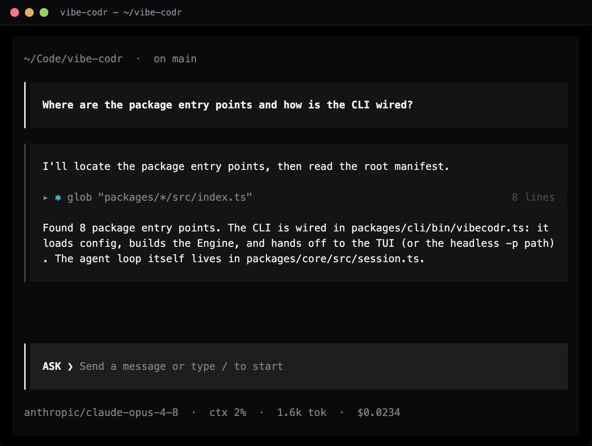
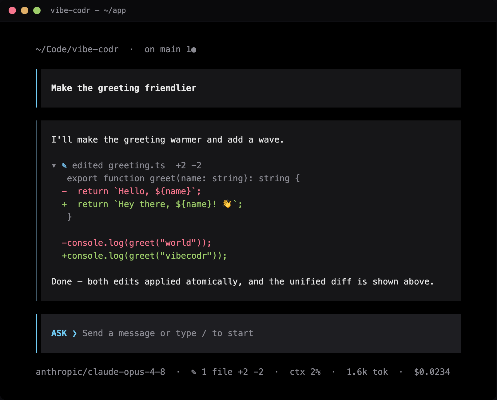
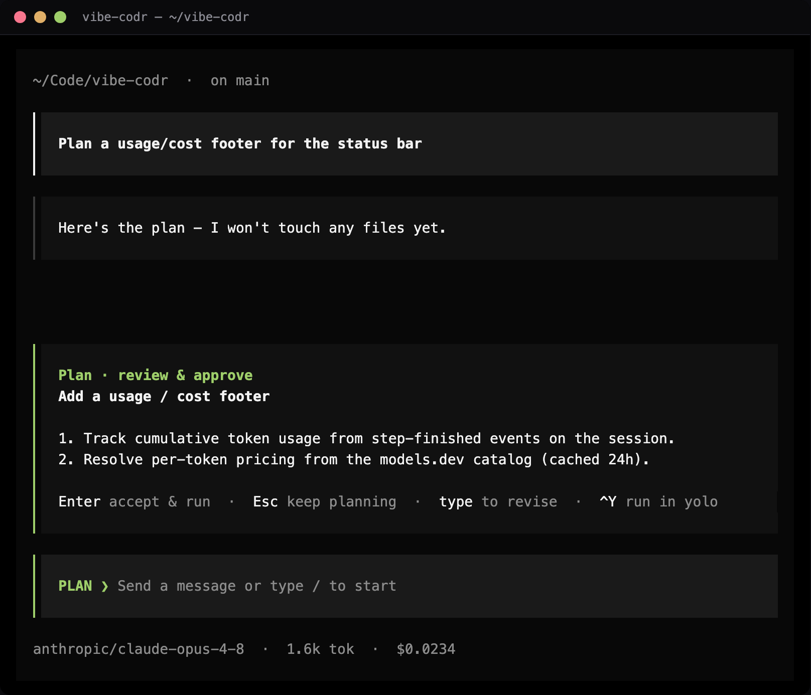
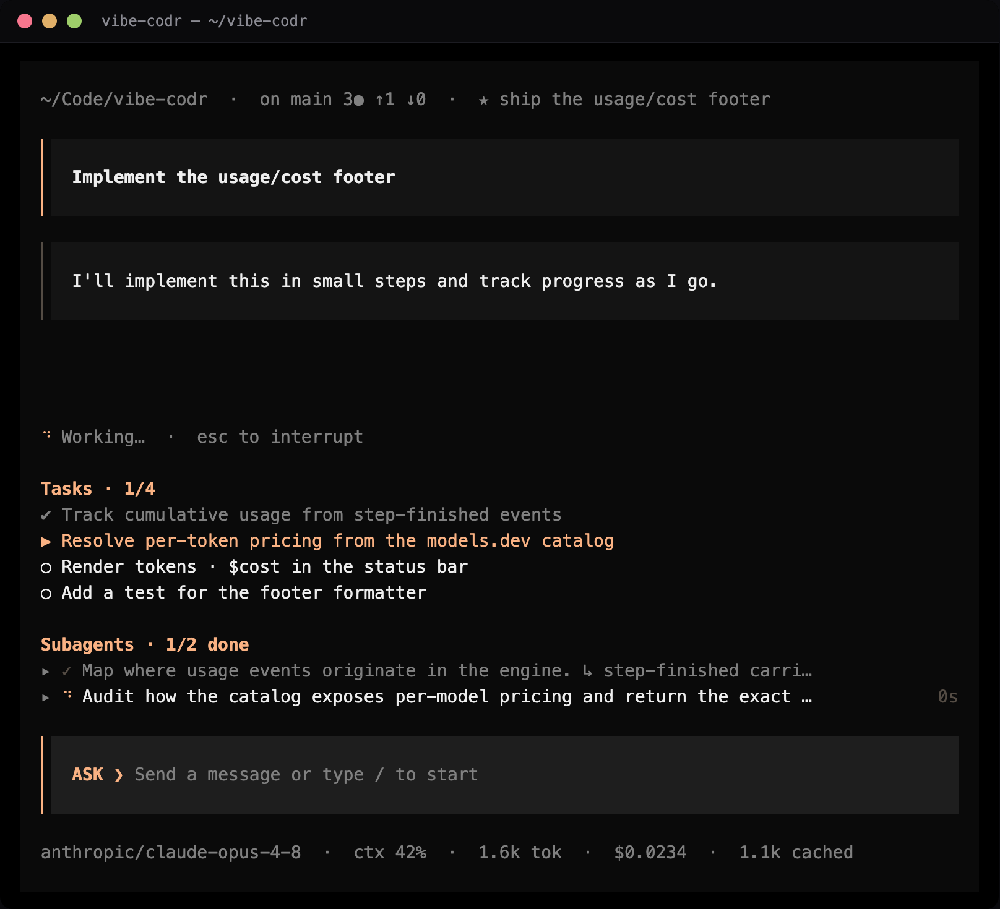
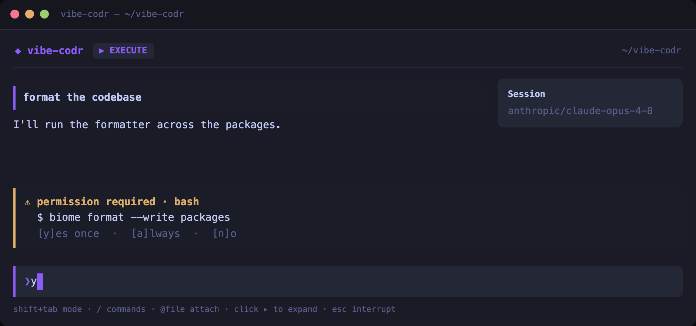
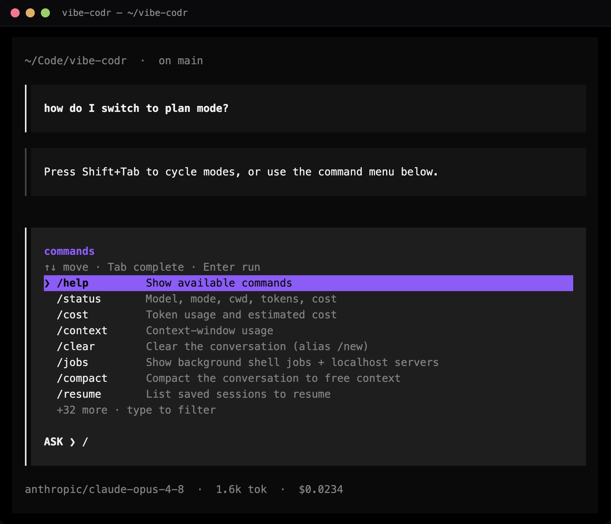

# vibe-codr

A cutting-edge, **model-agnostic** CLI coding agent for the terminal — in the
class of Claude Code / Codex / opencode, but able to drive coding and agentic
tasks on *any* model: local models via **Ollama** and **LM Studio**, aggregators
(**OpenRouter, Fireworks, Together, Baseten**), and first-party providers
(**OpenAI, Anthropic, Google Gemini, DeepSeek, xAI/Grok, Groq, Mistral, Cerebras,
Perplexity, MiniMax**) — plus **OpenAI Codex via your `codex login` session** and a
generic **custom** provider for any OpenAI-compatible endpoint (your own base URL +
key). Model context windows, pricing, and capabilities come live from
[models.dev](https://models.dev) (24h cache; `/models refresh` to force the
latest) — never hardcoded.

> Status: **feature-complete.** Multi-provider agent loop, live model catalog,
> **plan / execute / yolo** modes (Shift+Tab to cycle) with a permission layer, a
> live **task list**, an observable **prompt queue**, an interactive
> **slash-command menu**, skills / plugins, `/goal` + `/loop`, checkpoints/undo,
> self-verify, cache-aware cost tracking, and session persistence with
> context-aware compaction. On top of that:
>
> - **Long-term memory** — hybrid recall (BM25 + optional on-device semantic
>   embeddings, fused with reciprocal-rank fusion) over saved facts and past
>   sessions, a `save_memory` write-path, a curated global `USER.md`, and opt-in
>   proactive recall + cross-session digests. Fully offline; degrades to lexical
>   when no embedder is present.
> - **Multi-agent orchestration** — parallel subagents with **exclusive per-file
>   write ownership**, a shared coordination **blackboard**, a tree-global
>   **adaptive concurrency limiter**, and an opt-in deterministic **task-DAG
>   scheduler** (`spawn_tasks`) with verify→retry.
> - **Research** — **keyless web search** (DuckDuckGo, no API key required;
>   TinyFish optional), a `repo_map` code-intelligence tool, and hardened
>   `webfetch` (SSRF-guarded, timeout + size caps).
> - **MCP** — stdio + Streamable-HTTP/SSE transports, tools, **resources**, and
>   **prompts**.
> - **Extensibility** — declarative shell/HTTP **hooks**, project + global
>   skills/commands, and per-agent tool allowlists.
>
> A full slash-command surface (`/status` `/cost` `/config` `/diff` `/recall`
> `/mcp` `/review` `/doctor` `/export` …) makes every setting and bit of session
> state reachable. All covered by **488 tests** (including mock-model integration
> tests of the agent loop with zero network) plus a TUI render smoke test and a
> compiled-binary check.
>
> The terminal command is **`vibecodr`** (`vibe` works as an alias).

## Screenshots

An opencode-inspired terminal UI on vibe-codr's own engine, with a deliberate
color language: a **black background** and **neutral white/grey chrome**, with
color reserved for four tasteful zones — a **rainbow-gradient VIBE CODR wordmark**,
the input's **mode chip** (ASK blue · PLAN green · YOLO red), the **rainbow thinking
spinner**, and a **per-subagent / per-step rainbow** (override the accent with
`/accent <hex>`). The mode chip on the input's top border makes switching mode
unmistakable without repainting the screen. The other colors are purely functional
— green/red on diffs, amber on warnings. The layout is a **single, centered chat
column**
(ChatGPT-style): it fills a narrow terminal and centers on a wide one, with **no
sidebar and no top header**. A fresh screen shows a **centered VIBE CODR wordmark**;
once you start, the column is the scrolling **transcript**, the live status — the
plan's **task list** and live **subagents** (one tidy line each, tap to expand) — in
panels above the input, and the input itself: a **clean white closed box whose top
border carries the mode chip**. **All the details sit under the input** — cwd · git,
then model · changed-files · context · cost, plus key hints and the goal. Each user
turn sits in a heavy left-gutter block (**tap your message to fold the whole
exchange** under it), with the rainbow step gutters and the input frame aligned on
one left edge; **assistant replies render beautifully** — prose as Markdown, with
**code blocks and tables as clean native primitives** (aligned columns); tool calls
read as a distinct icon + action (`$` bash, `→` read, `←` edit, `✱` glob/grep,
`◈` websearch, `±` git…) and **condense to one line you click to expand**, while
edits fold into a single diff row with the hunk shown beneath it; a rainbow braille
spinner shows live work; the slash menu is mouse-clickable and drills into rich
submenus (a searchable model picker, clickable toggles).

| Chat + tool calls | Live diff |
|---|---|
|  |  |

| Plan mode | Task list + subagents panels |
|---|---|
|  |  |

| Permission card | Slash-command menu |
|---|---|
|  |  |

<sub>Regenerate with `bun packages/core/scripts/screenshot.ts docs/screenshots`
(drives the real engine with a mock model; bundled Playwright Chromium).</sub>

## Stack

- **Runtime:** TypeScript + [Bun](https://bun.sh) (workspaces + Turbo).
- **Models:** [Vercel AI SDK v5](https://ai-sdk.dev) (`streamText` + `tool()` +
  `stopWhen: stepCountIs`) as a unified, always-current provider abstraction.
- **Catalog:** live provider `/v1/models` merged with the
  [models.dev](https://models.dev) capability/pricing catalog — never hardcoded.
- **TUI:** [OpenTUI](https://github.com/anomalyco/opentui) (Solid) for the
  interactive UI, with a guaranteed readline + headless fallback.

## Architecture

A hard **core/TUI boundary**: the engine emits a typed `UIEvent` stream and
accepts `EngineCommand`s; no UI type leaks into core, so the UI is swappable and
the engine is fully testable headless.

| Package | Owns |
|---|---|
| `@vibe/shared` | Contracts: `UIEvent`, `Message`/`Part`, `ToolDefinition`, `EngineClient`, errors, logger |
| `@vibe/config` | Zod config schema, file discovery + deep-merge, auth resolution |
| `@vibe/providers` | `ProviderRegistry`, `resolveModel`, `CatalogService` (models.dev + `/v1/models`) |
| `@vibe/tools` | Built-in tools with `readOnly` flags + the AI-SDK `tool()` adapter / `Toolset` |
| `@vibe/core` | Agent loop (`Session.run`), mode gating, subagent fork, event bus, `Engine` |
| `@vibe/plugins` | `HookBus`, `PluginApi`, slash-command + skill runtimes |
| `@vibe/tui` | OpenTUI app + headless/REPL renderers |
| `@vibe/cli` | `bin/vibe` entrypoint (argv, config, headless `-p` vs TUI) |

## Quick start

```bash
bun install
# Install the providers you'll use + the rich TUI (optional peer deps):
bun add -D @ai-sdk/anthropic @ai-sdk/openai @opentui/core @opentui/solid solid-js
bun link                      # makes `vibecodr`/`vibe` available on your PATH

# interactive — on first run, a guided setup lets you pick a provider
# (Anthropic, OpenAI, Ollama Cloud, …), keys you already have in your env are
# auto-detected, and it fetches the live model list so you just pick one.
# Saved to ~/.config/vibe-codr/config.json. Re-run it anytime with `vibe setup`.
vibecodr

# one-shot (headless / pipeable)
vibecodr -p "list the TS files and read package.json" \
  --model anthropic/claude-opus-4-8

# machine-readable output (for scripting) and prompt-from-stdin
vibecodr -p "summarize this" --output-format json
cat task.md | vibecodr -p -            # read the prompt from stdin
cat task.md | vibecodr -p ""           # empty -p also reads stdin (no onboarding)
# Headless exits non-zero on engine error, so `vibecodr -p … && next` is safe in CI.

# other entry points
vibecodr setup                # (re)run the guided provider/model setup (alias: login)
vibecodr models               # list models for configured providers
vibecodr --continue           # resume the most recent session
vibecodr --resume <id>        # resume a specific session

# (without linking, run from source: `bun packages/cli/bin/vibecodr.ts ...`)
```

### Ollama Cloud (subscription)

Run big open models on ollama.com with your subscription — no local GPU:

```bash
export OLLAMA_API_KEY=...      # from https://ollama.com/settings/keys
vibecodr setup                 # pick "Ollama Cloud" (it's preselected when the key is set)
# or skip setup and go straight in:
vibecodr --model ollama/gpt-oss:120b
```

With a key set, vibecodr automatically targets `https://ollama.com/v1`. Run
`vibecodr models` to list the exact ids your subscription exposes (e.g.
`ollama/gpt-oss:120b`, `ollama/qwen3-coder:480b`, `ollama/deepseek-v3.1:671b`).

### OpenAI Codex (reuse your ChatGPT login)

If you've logged in with the official Codex CLI (`codex login`), vibecodr reuses
its credentials — no API key to paste:

```bash
codex login                    # once, with the official OpenAI Codex CLI
vibecodr setup                 # pick "OpenAI · Codex (ChatGPT login)" — it's auto-detected
vibecodr --model codex/gpt-5.2-codex
```

It reads `~/.codex/auth.json` (API key or ChatGPT OAuth token) and re-reads it each
turn, so refreshes are picked up. For ChatGPT-subscription use, point
`CODEX_BASE_URL` at the right backend and add any required `headers` under
`config.providers.codex`. Any provider can reuse another CLI's token via
`config.providers.<id>.tokenFile` / `tokenPath`.

### Any OpenAI-compatible endpoint (`custom`)

Point vibecodr at any OpenAI-style API — a gateway, a self-hosted server, a
provider not listed above:

```bash
vibecodr setup                 # pick "Custom · OpenAI-compatible endpoint"
# or set it directly in ~/.config/vibe-codr/config.json:
#   "providers": { "custom": { "baseURL": "https://my-endpoint/v1", "apiKey": "…" } }
vibecodr --model custom/my-model-id
```

### Keeping models current

Model metadata (context window, pricing, capabilities) is fetched live from
[models.dev](https://models.dev) and cached 24h. New models appear automatically;
run `/models refresh` (in-session) to force-pull the very latest right away.

### In-session commands

Type `/` to open the **command menu** — it filters as you type, `↑`/`↓` to
highlight, `Tab` to complete, `Enter` to run, `Esc` to dismiss. Commands with a
fixed set of values (`/approvals`, `/reasoning`, `/theme`) drill into a second
menu so you can pick the value. Or type `/help` for the full, grouped list.
Highlights:

- **Session** — `/status` (model, mode, cwd, context %, tokens, cost), `/cost`,
  `/context` (window usage + compaction threshold), `/clear` (alias `/new`),
  `/compact`, `/resume`, `/recall <text>` (search past sessions), `/export [path]`,
  `/init`, `/exit`.
- **Model & mode** — `/model` (opens a live, searchable picker; or `/model <id>`,
  `/model sub <id>` for a dedicated subagent model, `/model key <provider> <key>` —
  all persisted), `/models` (`/models refresh` force-pulls the latest), `/plan`,
  `/execute`, `/approvals <ask|auto>`, `/reasoning <low|medium|high|off>`,
  `/theme <default|light|contrast|opencode>`.
  Press **Shift+Tab** to cycle the mode (the colored chip on the input's top
  border): **plan → execute → yolo → plan**.
- **Steering** — `/goal <text>`,
  `/loop [interval] <prompt> [--until <cond>] [--max N]` (`/loop stop`),
  `/queue` (`/queue clear`).
- **Code & safety** — `/diff`, `/review`, `/verify`, `/undo`, `/checkpoints`.
- **Extensions & config** — `/config` (effective settings, secrets masked),
  `/memory` (loaded project/global notes), `/permissions`, `/tools`, `/agents`,
  `/skills`, `/commands`, `/mcp`, `/doctor` (environment health check).

Custom commands live in `.vibe/commands/*.md`, skills in `.vibe/skills/*/SKILL.md`,
named subagents in `.vibe/agents/*.md`, and plugins are listed in config.

### Features

- **opencode-inspired terminal UI** — built on vibe-codr's own engine, with a
  deliberate color language: a **black background** and **neutral white/grey
  chrome**, with color reserved for four tasteful zones — a **rainbow-gradient VIBE
  CODR wordmark**, the input's **mode chip** (ASK blue / PLAN green / YOLO red), the
  **rainbow thinking spinner**, and a **per-subagent / per-step rainbow** so a
  fan-out or a run of steps is easy to follow; green/red/amber stay reserved for
  diffs and warnings (override the accent with `/accent <hex>`). A **single,
  centered chat column** (ChatGPT-style — no sidebar, **no top header**) fills a
  narrow terminal and centers on a wide one: a fresh screen shows the wordmark, then
  the scrolling transcript, the **task list** and live **subagents** (one line each,
  tap to expand) in panels above the input, the input as a **clean white closed box
  whose top border carries the mode chip**, and **all the details under it** (cwd ·
  git / model · changed · ctx · cost, plus hints + goal). The user gutter, the
  rainbow step gutters, and the input frame all align on one left edge. User turns
  render in a heavy left-gutter block (**tap your message to fold the whole
  exchange**); **assistant replies render beautifully** — prose through OpenTUI's
  native Markdown (inline bold/italic/code concealed), with **code blocks and GFM
  tables rendered as clean native primitives** (aligned columns, box-drawing); tool
  calls read as a distinct icon + action label (`$` bash, `→` read, `←` edit/write,
  `✱` glob/grep, `◈` websearch, `±` git, `✦` subagent…) and **condense to one line
  you click to expand**, while edits fold into a single diff row with the hunk
  beneath it. Streamed text is coalesced so long replies stay smooth. A braille
  spinner with elapsed time shows live work (**Esc** interrupts the turn). The
  slash menu is **mouse-clickable** and drills into rich submenus — a **live,
  searchable model picker** (filter, click, current marked) and clickable
  theme/approvals/reasoning toggles. Permission prompts surface as a bordered card
  answerable with `y`/`a`/`n`. Four themes ship — `default` (black), `light`,
  `contrast`, and `opencode` (warm peach).
- **Plan / execute / yolo** — three modes, cycled with **Shift+Tab** (or
  `/plan`, `/execute`, `/approvals auto`). **Plan** exposes only read-only tools
  (the model calls `present_plan`; you approve to proceed). **Execute** allows
  edits/commands, each gated by a glob-based allow/deny/ask **permission layer**.
  **Yolo** runs side-effecting tools without prompting. The mode chip on the
  input's top border is color-coded (ASK blue / PLAN green / YOLO red) so the
  active mode is unmistakable, while the rest of the chrome stays neutral.
- **Resilience & git/process tools** — provider calls retry transient failures
  (network / 429 / 5xx) with exponential backoff (`retry` config) and surface a
  notice instead of failing silently. Structured `git_status` / `git_diff` /
  `git_log` / `git_commit` / `git_push` tools avoid hand-parsing porcelain and
  let the agent commit and publish to GitHub end-to-end; `git_diff` can target a
  commit, branch, or range (`ref:"HEAD"`, `"main"`, `"main...HEAD"`) so the agent
  can review its whole session's committed work, not just the working tree. And
  `bash background:true`
  starts long-running commands you poll with `job_status` / stop with `job_kill`.
  For richer GitHub workflows (issues, PRs, reviews), connect the official
  [GitHub MCP server](https://github.com/github/github-mcp-server) under
  `mcp.servers` (see the MCP example below).
- **`@file` mentions & images** — reference files inline (`summarize @src/app.ts`)
  and their contents are injected as context; image mentions (`@shot.png`) are
  attached for vision models (with a notice when the model lacks vision). The
  REPL supports multi-line input (end a line with `\`) and **Ctrl-C aborts the
  current turn** instead of killing the process. Assistant text renders Markdown
  (headings, bold/italic, code, lists) in the interactive UI.
- **Surgical edits with live diffs** — the `edit` tool replaces exact text
  (`replaceAll` for non-unique matches) and accepts an `edits` array applied
  **atomically** (all-or-nothing); every `edit`/`write` returns a unified diff and
  emits a `file-changed` event, so the UI shows what changed in green/red as it
  happens. Mutating tools are **serialized within a step** — when a model emits
  parallel tool calls (most do), edits/writes/bash to the same files can't race;
  read-only tools still run concurrently.
- **Task list** — for any multi-step request the agent maintains a live
  checklist via the `update_tasks` tool (pending / in-progress / completed),
  rendered in the UI and persisted with the session so it survives `--resume`.
  The list can be seeded while planning and carries into execution.
- **Prompt queue** — type-ahead while a turn is running; submitted prompts form
  a visible, ordered backlog that drains one at a time so history stays
  consistent. `/queue` shows it, `/queue clear` (or aborting) drops what's
  waiting.
- **Web search & context gathering** — `web_search` works **keyless by default**
  (DuckDuckGo, no API key); a [TinyFish](https://tinyfish.ai) key
  (`TINYFISH_API_KEY` / `search.apiKey`) is an optional higher-quality booster
  tried first. Disable with `search.enabled: false`. The model searches the live
  web and follows up with `webfetch` (SSRF-guarded, with a wall-clock timeout and
  a streaming size cap). Search depth is **adaptive and model-controlled** — a
  quick fact is answered straight from the snippets (one query, no fetch), while a
  hard question goes deep (more queries, full-page fetches, cross-checking).
- **Code intelligence** — a `repo_map` tool returns a ranked file→symbol map
  (exports, functions, classes, types) so the model can orient on an unfamiliar
  repo or subsystem in one cheap call before blind glob/grep.
- **Dependency currency** — a `package_info` tool returns the authoritative latest
  version + metadata from npm or PyPI, the fast, reliable way to check whether a
  project's stack is up to date (read the manifest, then compare against the real
  latest) instead of scraping blog posts. No key required.
- **MCP client** — connect [Model Context Protocol](https://modelcontextprotocol.io)
  servers under `mcp.servers` over **stdio, Streamable HTTP, or SSE** (`transport:
  "http" | "sse"` for a URL). Server **tools** register as `mcp__<server>__<tool>`
  (honoring `readOnlyHint`), **resources** are reachable via `read_mcp_resource`,
  and **prompts** via `get_mcp_prompt`; `/mcp` shows live per-server status.
  Servers connect in parallel with a timeout so one slow server can't block
  startup. Requires the optional `@modelcontextprotocol/sdk` peer dep; failures
  are skipped, not fatal.
- **Interactive permissions** — side-effecting tools prompt for approval
  (**allow once / always / deny**) under `approvalMode: "ask"` (the default);
  `always` is remembered for the session. Headless runs auto-allow. `auto` mode
  or explicit allow/deny rules skip the prompt.
- **Checkpoints & undo** — in a git repo, the workspace is snapshotted before
  each edit turn (a hidden `refs/vibecodr/*` ref — your branch/history untouched);
  `/undo` rolls back, `/checkpoints` lists them.
- **Self-verify** — set `verify.command` (e.g. `"bun run typecheck && bun test"`)
  and run it with `/verify`; with `verify.auto`, failures after an edit turn are
  fed back so the agent self-corrects (capped by `verify.maxRetries`).
- **Live token & cost tracking** — cumulative input/output tokens and an
  estimated USD cost are tracked every step and shown in the status bar / footer.
  Prices come from the live catalog (models.dev); override or pin a rate per
  model in config under `pricing` (USD per 1M tokens). Cached input tokens are
  surfaced when the provider reports them.
- **Prompt caching, reasoning & spend guard** — the stable system prefix is sent
  with Anthropic cache markers by default (`caching.enabled`) so repeated turns
  reuse it; `reasoning.budgetTokens` / `reasoning.effort` drive extended thinking
  per provider; `budget.limitUSD` warns (or, with `onExceed: "stop"`, halts the
  turn) when a session's cost crosses the cap.
- **Subagents / multi-agent coding** — `spawn_subagent` forks an isolated child
  with its own context that returns only its final answer. The model is coached
  (in the execute-mode system prompt) on _when_ to fan out, writing self-contained
  child prompts, disjoint-file ownership, and consolidating + verifying results.
  Three coding agents ship by default — **`explore`** (read-only research),
  **`review`** (adversarial code review), **`test`** (write/run tests) — and the
  roster is injected into the prompt so the model can route by capability;
  `.vibe/agents/*.md` add or override them by name. Planning can fan out too —
  while in plan mode every subagent is coerced read-only, so you get parallel
  codebase exploration before converging on a plan, with no risk of a write.
  Fan-out is bounded by `subagent.maxParallel` (default 4) and recursion by
  `subagent.maxDepth` (default 3). A tree-wide **exclusive-ownership** file lock
  hard-rejects a concurrent write to a file another subagent owns (instead of
  silently clobbering it); a shared **blackboard** (`post_note` / `read_notes`)
  lets parallel agents coordinate; and a tree-global **adaptive concurrency
  limiter** keeps a wide fan-out from stampeding the provider. Set a default
  subagent model with `subagent.model`.
- **Deterministic orchestration (opt-in)** — enable `orchestration.enabled` to
  offer `spawn_tasks([{objective, deps, files, verify, agent}])`: the model
  submits a whole dependency-ordered plan and the **engine** schedules it —
  independent tasks run in parallel, dependents unlock as inputs complete, a task
  whose dependency failed is skipped, and a `verify:true` task is reviewed and
  retried. The inline `spawn_subagent` path is unchanged when it's off.
- **`/goal`** injects a north-star into every system prompt; **`/loop`** reruns a
  prompt on an interval until a `--until` condition (checked with a structured
  model call) or `--max` is reached.
- **Persistence & compaction** — every turn is saved to
  `.vibe/sessions/<id>/`; long conversations auto-compact against the active
  model's context window (from the catalog), preserving the system prompt, goal,
  and most recent turns. The status bar shows live context fill (`ctx 45%`) and
  `/context` reports the window plus the compaction threshold so you always know
  how close you are to the limit.
- **Long-term memory (hybrid recall + write-path)** — the agent both **saves**
  and **recalls** durable knowledge. `save_memory` persists a fact/decision/
  preference (project `.vibe/memory/` or global `~/.config/vibe-codr/memory/`,
  dated markdown); `/recall <text>` and the `recall_memory` tool search **saved
  memory + past sessions** and rank with reciprocal-rank fusion. Lexical BM25
  works fully offline with zero setup; add on-device embeddings
  (`bun add @huggingface/transformers`, `memory.semantic.model: "local"`) or a
  cloud embedder for **semantic** recall on top — it degrades cleanly to lexical
  when no embedder is present. Opt-in `memory.proactiveRecall` injects relevant
  past context at session start; `memory.sessionDigest` writes a cross-session
  digest at the end.
- **Project & global memory** — `VIBE.md`, `AGENTS.md`, or `CLAUDE.md` are
  injected into every system prompt, so the agent follows your stack and
  conventions out of the box. Discovery **walks up from the working directory to
  the git root**, so running from a subdirectory still picks up the repo-root
  notes; a user-global `~/.config/vibe-codr/VIBE.md` and a curated
  `~/.config/vibe-codr/memory/USER.md` (preferences / standing rules) apply
  everywhere. Precedence is explicit (global < repo-root < closer dirs; closest
  wins), each block is labelled with its source, files are byte-capped, and
  `/memory` shows exactly what's loaded. Drop-in compatible with repos already
  carrying Codex's `AGENTS.md` or Claude Code's `CLAUDE.md`.
- **Hooks, skills & commands (project + global)** — skills and slash-commands
  load from both the project's `.vibe/{skills,commands}` and user-global
  `~/.config/vibe-codr/{skills,commands}` (project overrides global). Declarative
  `hooks` in config run a shell command or POST a URL on lifecycle events and can
  **deny a tool** or **rewrite its input** (a `{deny,reason}` / `{input}` JSON
  protocol), layered onto the in-process plugin hook bus.

Model strings are `<provider>/<model-id>` (split on the first slash):
`anthropic/claude-opus-4-8`, `openai/gpt-...`, `deepseek/...`, `xai/grok-...`,
`minimax/MiniMax-M1`, `codex/gpt-...`, `openrouter/anthropic/claude-...`,
`fireworks/...`, `baseten/...`, `lmstudio/<id>`, `ollama/llama3.1`.

#### Providers & subscription auth

All providers run on **AI SDK v5**. anthropic/openai/deepseek use their dedicated
v5 SDKs; every other provider (xai, openrouter, fireworks, baseten, minimax,
ollama, lmstudio) is driven through `@ai-sdk/openai-compatible` so it works out of
the box without chasing incompatible SDK majors.

| Provider | Auth | Notes |
|---|---|---|
| `anthropic` `openai` `deepseek` `fireworks` `baseten` `openrouter` | `*_API_KEY` env or `providers.<id>.apiKey` | first-party + aggregators (the OpenAI-compatible ones via the shared compat driver) |
| `xai` (**Grok**) | `XAI_API_KEY` (console.x.ai) | OpenAI-compatible; point `XAI_BASE_URL` at a gateway if your subscription is brokered elsewhere |
| `minimax` (**MiniMax**) | `MINIMAX_API_KEY` | OpenAI-compatible; your MiniMax subscription token. `MINIMAX_BASE_URL` overrides region |
| `codex` (**OpenAI Codex**) | reuses `~/.codex/auth.json` | uses the credential the Codex CLI already stored — an OpenAI API key works directly; for **ChatGPT-subscription OAuth** set `CODEX_BASE_URL` (and any `providers.codex.headers`) to your Codex backend, since that token targets a different endpoint than `api.openai.com` |
| `lmstudio` | none (keyless) | local; `LMSTUDIO_BASE_URL` (default `:1234`) |
| `ollama` | none (local) or `OLLAMA_API_KEY` (cloud) | **Local:** run `ollama serve` (`OLLAMA_BASE_URL`, default `:11434`); keyless. **Ollama Cloud:** set `OLLAMA_API_KEY` (from ollama.com/settings/keys) and it auto-targets `https://ollama.com/v1` — model ids are plain (no suffix), e.g. `ollama/gpt-oss:120b`; run `vibecodr models` to list yours. Override the host with `OLLAMA_BASE_URL`. |

**Any** provider can authenticate from a credential file or with extra headers —
useful for subscription/OAuth tokens another CLI obtained:

```jsonc
"providers": {
  "codex":   { "tokenFile": "~/.codex/auth.json", "headers": { "chatgpt-account-id": "acct_…" } },
  "minimax": { "apiKey": "mm-…" },
  "xai":     { "baseURL": "https://your-grok-gateway/v1", "tokenFile": "~/.grok/token" }
}
```

A JSON `tokenFile` is searched for common fields (`OPENAI_API_KEY`,
`tokens.access_token`, `api_key`, …) or a `tokenPath` you specify; a plain-text
file is used verbatim. Resolution order is **env → `apiKey` → `tokenFile`**.

Provider SDKs (`@ai-sdk/*`, `@openrouter/ai-sdk-provider`) and OpenTUI are
**optional** peer deps — install the ones you use; a missing one yields a clear
error rather than blocking startup.

### Config

Config is JSONC, deep-merged low→high: defaults → `~/.config/vibe-codr/config.json`
→ `.vibe/config.json` → env → CLI flags. Beyond `model`, `mode`, `maxSteps`,
`permissions`, and `plugins`:

```jsonc
{
  "model": "anthropic/claude-opus-4-8",
  "subagent": {                                         // fan-out + concurrency
    "model": "anthropic/claude-haiku-4-5", "maxDepth": 3, "maxParallel": 4,
    "providerConcurrency": 16, "timeoutMs": 300000, "verifyMaxAttempts": 2
  },
  "orchestration": { "enabled": false },                // opt-in spawn_tasks DAG
  "search": { "enabled": true },                        // keyless DDG; apiKey = optional TinyFish booster
  "memory": {                                           // long-term memory
    "semantic": { "enabled": true, "model": "local" },  // "local" | "provider/model" | "off"
    "proactiveRecall": false, "sessionDigest": false
  },
  "webfetch": { "allowPrivateHosts": false, "timeoutMs": 8000 }, // SSRF policy
  "hooks": [                                            // declarative shell/HTTP hooks
    { "event": "tool.before.execute", "matcher": "bash", "command": "./policy.sh" }
  ],
  "pricing": {                                          // USD per 1M tokens (+ cacheRead)
    "anthropic/claude-opus-4-8": { "input": 5, "output": 25, "cacheRead": 0.5 }
  },
  "approvalMode": "ask",                                // ask | auto
  "theme": "default",                                   // default | light | contrast | opencode
  "caching": { "enabled": true },                       // Anthropic prompt caching
  "reasoning": { "effort": "high", "budgetTokens": 8000 }, // thinking controls
  "budget": { "limitUSD": 5, "onExceed": "warn" },      // spend guard: warn | stop
  "checkpoints": { "enabled": true },
  "verify": { "command": "bun run typecheck && bun test", "auto": true, "maxRetries": 2 },
  "mcp": {
    "servers": {
      // GitHub: issues, PRs, reviews, code search. Needs a personal access
      // token; tools register as mcp__github__* and flow through the permission gate.
      "github": {
        "command": "npx",
        "args": ["-y", "@modelcontextprotocol/server-github"],
        "env": { "GITHUB_PERSONAL_ACCESS_TOKEN": "ghp_..." }
      },
      // Remote server over Streamable HTTP (or "sse"); headers carry auth.
      "docs": { "url": "https://mcp.example.com/mcp", "transport": "http",
                "headers": { "Authorization": "Bearer ..." } }
    }
  },
  "providers": { "anthropic": { "apiKey": "sk-..." } }
}
```

API keys belong in env vars or this file; keys entered during first-run setup
are written to the user-global config.

## Develop

```bash
bun run lint          # biome lint across packages
bun run format        # biome format --write
bun run typecheck     # tsc across all packages
bun test              # unit tests
bun run smoke:tui     # drive the real OpenTUI app (mock engine) — input, streamed
                      # output, tool icons, working spinner, the command menu, and
                      # the permission card — via the test renderer
bun packages/core/scripts/screenshot.ts docs/screenshots  # regenerate README shots
bun run build:binary  # standalone binary -> dist/vibecodr (bun --compile)
```

`vibecodr sessions` lists saved sessions (resume one with `--resume <id>`).
`vibecodr setup` re-runs the guided provider/model setup at any time.

## Status

All planned phases are implemented and tested:

0. ✅ Full scaffold (monorepo, contracts, core/TUI boundary)
1. ✅ Agent spine — `streamText` loop with multi-step tool execution
2. ✅ Multi-provider + live model catalog (models.dev + `/v1/models`)
3. ✅ Permission layer + plan/execute gating
4. ✅ Subagents (isolated, depth-capped, parallel) + named agents
5. ✅ Slash command files, skills (progressive disclosure), plugins
6. ✅ `/goal` steering + `/loop` (interval, `--until`, `--max`)
7. ✅ Session persistence (`--continue`/`--resume`) + context-aware compaction
8. ✅ Parity & polish — full introspection/settings command surface, project
   memory (VIBE.md/AGENTS.md/CLAUDE.md), JSON headless output + stdin, themes,
   `/doctor`, `/export`, Ollama + structured `git_log`/`git_push` for GitHub.
9. ✅ TUI UX — the plan/execute/yolo mode shown (and color-coded) on the input's
   top border (Shift+Tab to cycle), an interactive slash-command menu, first-class Ollama Cloud, and a
   guided `vibecodr setup`; the OpenTUI app is covered by `bun run smoke:tui`.
10. ✅ opencode-inspired UI — black, centered single-column chat (no top header:
    a VIBE CODR wordmark splash, the transcript, tasks/subagents panels above the
    input, the mode break on the input's top border, and all details under it),
    tap-your-message-to-fold, a **`/jobs` sub-view** (running shell commands +
    auto-detected localhost servers), left-gutter message blocks, native Markdown
    replies (incl. tables), per-tool icons + action labels, condensed tool output that expands on click,
    edits folded into one diff row (tinted backgrounds), a braille working spinner
    (Esc to interrupt), a bordered permission card, full-row menu highlight, and
    the `opencode` theme.
11. ✅ Hardening audit — every provider runs on AI SDK v5 (OpenAI-compatible
    routing); parallel tool calls serialized; subagent isolation on `--resume`;
    memory walks to the git root (byte-capped); atomic, corruption-tolerant
    session store; loop runs serialized + abortable; alternation-safe compaction;
    plugin hooks wired (incl. a working `deny` gate) and isolated; MCP auth
    headers; tool-name/safety-command shadow guards; `/undo` rewinds files +
    history without touching your git index; non-zero headless exit on error.

To run interactively against real models, install the provider SDKs you use
(`@ai-sdk/*`, `@openrouter/ai-sdk-provider`), OpenTUI for the rich UI
(`@opentui/core`, `@opentui/solid`, `solid-js`), and `@modelcontextprotocol/sdk`
for MCP servers. Each is an optional peer dep — a missing one yields a clear,
actionable error (and the readline REPL fallback) rather than blocking startup.
